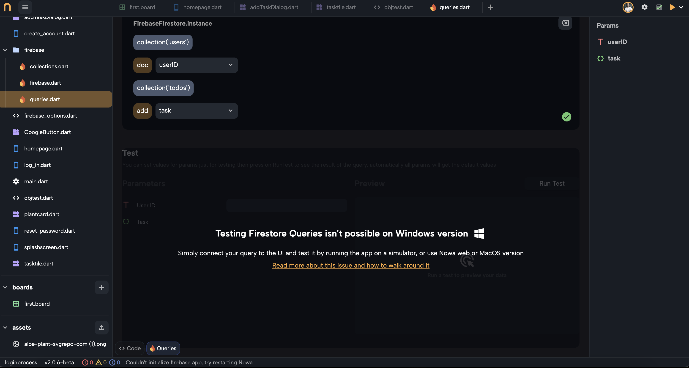

You will encounter this issue when trying to test Firestore Queries on Nowa Windows version

### The Problem  
Inside Firestore query panels, you usually can build and test queries on the go before connecting them to the UI. THis is unfortunately not possible when using Nowa Windows version

The reason behind this is that Firebase itself doesn't support Windows, so as Nowa Desktop version on Windows can't actually run the queries within Nowa itself

But this won't stop you from building an app that uses Firebase while using Nowa Windows version, so let's jump to solutions:

### How to Work Around It  
You can still continue building your app without a problem, here's three ways on how to deal with this issue:  

1. **Test your queries by running your app Directly**  
   1. Skip query testing in Nowa: You can still buid the queries, but you can't test them on the spot using the Query test section
   2. Connect your queries to the UI as explained in [Firestore page](../firestore.md)  
   3. Run your app on an emulator or a physical device to check the query results. If you run your app on iOS, Android, Web, Linux or MacOS app, you will be able to see the actual result of the queries.

2. **Use Nowa Web version or MacOS version**  
   - Test your Firestore queries in the Nowa web version or MacOS version, which supports Firebase.
   - If your app is local (hence can't be accessed from the Web version), you can connect another Nowa cloud project to the same Firebase project and build and test the same queries. When they work fine you can then just build the same ones in your main local project

   :::tip
   If you are a developer, you can also just copy paste the Firebase query code from the cloud project to the local one instead of manually repeat the queries for the local project

   We will soon release Github integration with cloud projects so you will be able to push a local project to be on the cloud as well
   :::   

3. **Try Firestore Query Builder**  
   - Use Firebase's built-in Firestore Query Builder to test your queries. When they are okay, build the same one inside Nowa Windows version and test them in the end by running your app on a simulator or a real device

If you need help, our support team (team@nowa.dev), our [Online community](https://community.nowa.dev) and [Discord community](https://discord.gg/ByKfn3H7gX) are here for you!