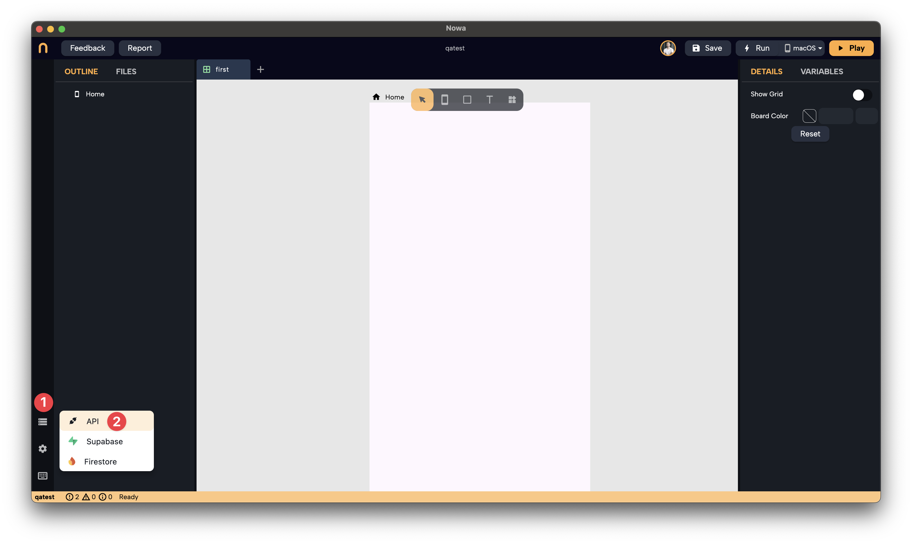

# Setting Up an API Request in Nowa

APIs (Application Programming Interfaces) are the backbone of communication on the internet. By using simple HTTP protocols, you can integrate with countless services around the world. 

Learning how to use APIs correctly empowers you to build powerful and dynamic apps. Nowa provides a robust way to integrate any API into your Flutter applications visually and effortlessly.

In this guide, we'll walk through the basics of setting up an API request in Nowa. We'll cover:

- Creating a collection
- Adding common data like base URLs and headers
- Creating a GET request
- Testing the request and viewing the response

:::tip
If you are a video type of person, here's a video explaining creating a GET request to:
1. fetch All Wordpress posts and display them
2. Fetch a specific post using Post ID

   <iframe width="767" height="431" src="https://www.youtube.com/embed/_ko4iKVXVuA" title="Display WordPress Blogs in Your App Using ListView and REST API | Nowa tutorial" frameborder="0" allow="accelerometer; autoplay; clipboard-write; encrypted-media; gyroscope; picture-in-picture; web-share" referrerpolicy="strict-origin-when-cross-origin" allowfullscreen></iframe>

:::

Want to continue reading? then let's get started!

## 1. Creating a Collection

A **collection** in Nowa is a group of API requests that share the same base URL and headers. This is useful when you're integrating with a service like WordPress, where multiple endpoints share common settings.

**Steps:**

1. Navigate to the **Data** section located at the bottom left of the Nowa interface.
2. Click on **API**.
3. Click on **Create Collection**.
4. Name your collection (e.g., `WordPress`).

**Why use a collection?**

- **Organization:** Keep all related requests together.
- **Efficiency:** Set common data like base URLs and headers once for all requests in the collection.

## 2. Adding Common Data

After creating your collection, you can add data that is common to all requests within it.

**Steps:**

1. Within your newly created collection, locate the settings for common data.
2. Add the **Base URL** (e.g., `https://public-api.wordpress.com/wp/v2/sites/nowablogapp.wordpress.com/`).
3. Add any common **headers** that all requests will use.

## 3. Adding a Request

Now that your collection is set up with common data, you can add your first API request.

**Steps:**

1. Click on **Add Request** within your collection.
2. Choose the **request type**: `GET`, `POST`, `PUT`, `DELETE`, `PATCH`, `HEAD`, or `DOWNLOAD`.
3. Enter the **endpoint** for the request (without the base URL). For example, to get all posts, use `posts`.
4. Specify any additional **parameters**, **headers**, or **body content** specific to this request.

## 4. Creating a GET Request Example

Let's walk through creating a `GET` request to retrieve all posts from a WordPress blog.

**Steps:**

1. **Request Type:** Select `GET`.
2. **Endpoint:** Enter `posts`.
3. **Test the Request:** Click on **Run Test** to execute the request.

Here's the full example of creating the `Wordpress` collection, then the `getAllPosts` request

**What happens next?**

- **Response Body:** You'll see the data returned from the API in the body section.
- **Response Headers:** View metadata about the response.
- **Full URI:** Verify the complete URL used for the request, which combines the base URL and endpoint.

## 5. Testing and Verifying the Response

Testing your API requests ensures that they work as expected before integrating them into your app.

**Steps:**

1. After running the test, review the **response body** to understand the data structure.
2. Check the **status code** to ensure the request was successful (e.g., `200 OK`).
3. Examine the **headers** for additional information like content type and caching policies.

## Next Steps

Now that you've set up a basic API request and tested it, you're ready to generate models from the response data and add mock data for design-time testing.

👉 **Head to the next section to learn how to generate a model from the response.**

Happy building!