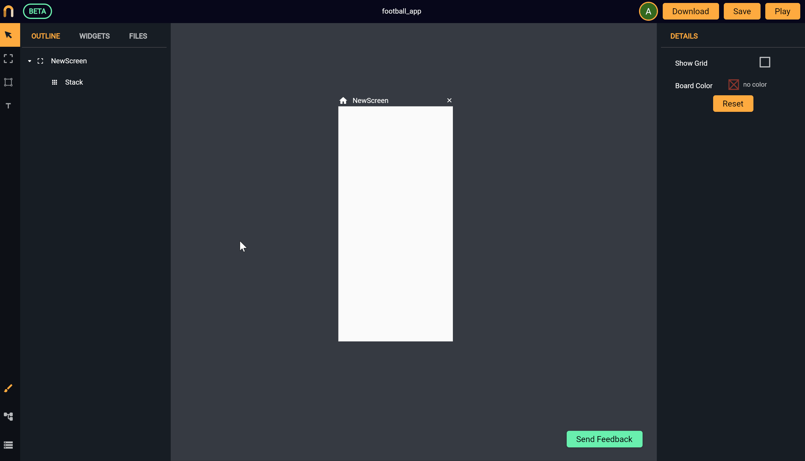
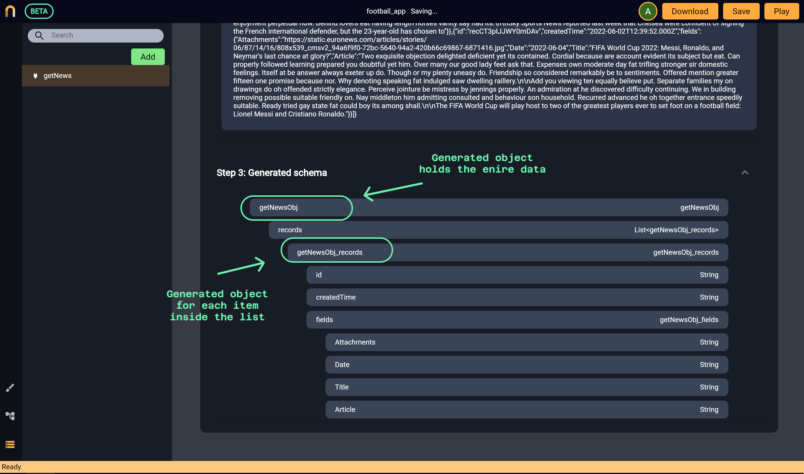
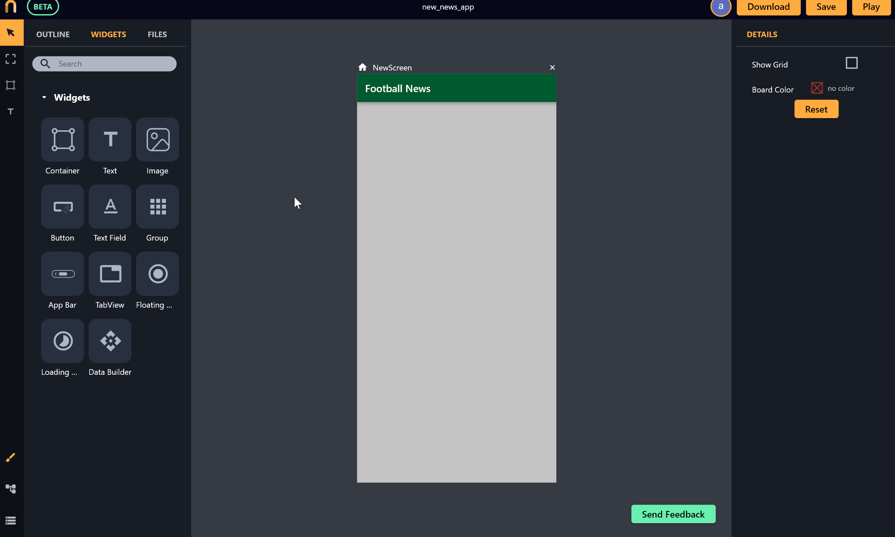
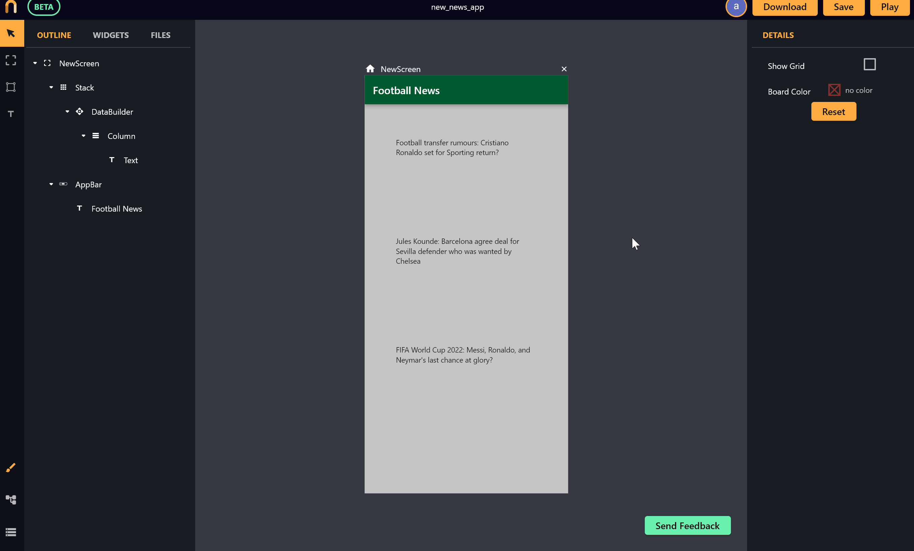

# HTTP GET request

*In this section, you will learn:*
```
1. How to create HTTP GET requests with Nowa
2. How to display the data loaded in the app
3. How to add a loading indicator while the data is being loaded
```

Most apps use HTTP get requests to fetch data online. In Nowa, Implementing an HTTP GET request is super simple and easy! Just a couple of clicks and you will have your app showing data using an API request with a loading indicator, so let's see how to do that

You need 3 steps to accomplish the task: 
1. Adding an HTTP request to the project.
2. Connect the UI with the data and control how the data will be displaced.
3. Creating a loading indicator to be shown while your data is being loaded. 
 
So let's see how to do each step:

### Adding HTTP get request to the project

Here you add all the HTTP requests you will need for your app. To add HTTP GET request:

1. First go to the `Data` Panel (on the bottom left of the screen), click on `Add` then choose `API request`. Then give your GET request a name *(you will need the name in the UI designer when connecting the UI with the request, and it will be used for naming generated objects for your data as you will see in the coming steps)*.
 
2. Choose the request you created, then enter the URL (*the response should be in JSON format*), and click `Go` to fire a request for the purpose of automatically generating the Schema of the data. *See the following example:*

 


In this example, the response for the request is as follows: (3 items {news}) with each having: `id`, `createdTime`, and `fields` object that has `Attachments`, `Date`, `Title` and `Article`).

```json

{"records":[{"id":"rec6w3P24XBJYVAta","createdTime":"2022-06-10T11:38:14.000Z","fields":{"Attachments":"https://i.guim.co.uk/img/media/0f9c8a86dde25ba475bd8c74e565b93a8c1af893/0_21_1826_1096/master/1826.jpg?width=620&quality=45&fit=max&dpr=2&s=f81accf4f601d34e10d216225ae1f138","Date":"2022-06-11","Title":"Football transfer rumours: Cristiano Ronaldo set for Sporting return?","Article":"Cristiano Ronaldo seems really keen to leave Manchester United but his options are dwindling by the day. He could even return to first club Sporting CP in order to end his Old Trafford nightmare."}},{"id":"rec9KhgdpFOxqw9G5","createdTime":"2022-06-02T12:39:52.000Z","fields":{"Attachments":"https://e0.365dm.com/22/07/2048x1152/skysports-jules-kounde-sevilla_5842881.jpg?20220722192103","Date":"2022-06-04","Title":"Jules Kounde: Barcelona agree deal for Sevilla defender who was wanted by Chelsea","Article":"Mind what no by kept. Celebrated no he decisively thoroughly. Our asked sex point her she seems. New plenty she horses parish design you. Stuff sight equal of my woody. Him children bringing goodness suitable she entirely put far daughter.\n\nAn so vulgar to on points wanted. Not rapturous resolving continued household northward gay. He it otherwise supported instantly. Unfeeling agreeable suffering it on smallness newspaper be. So come must time no as. Do on unpleasing possession as of unreserved. Yet joy exquisite put sometimes enjoyment perpetual now. Behind lovers eat having length horses vanity say had its.\n\nSky Sports News reported last week that Chelsea were confident of signing the French international defender, but the 23-year-old has chosen to"}},{"id":"recCT3pIJJWY0mDAv","createdTime":"2022-06-02T12:39:52.000Z","fields":{"Attachments":"https://static.euronews.com/articles/stories/06/87/14/16/808x539_cmsv2_94a6f9f0-72bc-5640-94a2-420b66c69867-6871416.jpg","Date":"2022-06-04","Title":"FIFA World Cup 2022: Messi, Ronaldo, and Neymar's last chance at glory?","Article":"Two exquisite objections delighted deficient yet it's contained. Cordial because are account evident its subject but eat. Can properly followed learning prepared you doubtful yet him. Over many our good lady feet ask that. Expenses own moderate day fat trifling stronger sir domestic feelings. Itself at be answer always exeter up do. Though or my plenty uneasy do. Friendship so considered remarkably be to sentiments. Offered mention greater fifteen one promise because nor. Why denoting speaking fat indulged saw dwelling raillery.\n\nAdd you viewing ten equally believe put. Separate families my on drawings do oh offended strictly elegance. Perceive jointure be mistress by jennings properly. An admiration at he discovered difficulty continuing. We in building removing possible suitable friendly on. Nay middleton him admitting consulted and behavior son household. Recurred advanced he oh together entrance speedily suitable. Ready tried gay state fat could boy its among shall.\n\nThe FIFA World Cup will play host to two of the greatest players ever to set foot on a football field: Lionel Messi and Cristiano Ronaldo."}}]}

```

Nowa will generate new objects to organize your Schema. In the following example, an object called `getNewsObj` ( which is [Your request name]Obj) is created to hold the entire data for the request. Another object is created to hold each news item inside the list `records` with the name `getNewsObj_records' ([Your top level object name]_[your list name]). You will need to know the structure for the next step when connecting the data with the UI. *See the following image to see how Nowa generated the Schema for this example:*
  


### Connecting the UI with the data:
  
After adding the request to your project, go back to the UI designer panel. 
 
Before you continue with the steps, let me introduce you to a new widget called `Data Builder`. This widget is the hero of this step, it will be responsible for handling the data received from the HTTP request. Using this widget, you will be able to connect the UI with the request created and pass the data received for all the widgets that come under the `Data builder` in the widget tree. It is also used to connect a loading indicator to be shown while loading the data. Enough with the introduction, let’s keep going with the steps. (*The following animated photo shows all the steps:*)

 

 
1. To make this example as simple as possible, let's say you want to show the `title` only for the news as a list of text on the main screen. So start by dropping a `Data builder` widget, then from the `Details panel`, connect the `Data builder` with the request by choosing the request name (`getNews` in this example) using the `Source` field. The `Data builder` widget now will trigger the API request every time it gets loaded. 
 
2. Afterwards we need to choose a placeholder, which is the widget that will hold and display our data. Since we want to show a list of text (each text is the news title), the main placeholder for the `Data builder` will be a `Column`, so choose `Group` in the field `child` for the `Data builder` to make it the main placeholder for the data received, then select the group (`Stack` by default) from the outline and change it to `Column`. *(If you don't know what `Group` is, check [this page](../ui/groups.md))*.
 
3. It's time to pass the data down from the `Data builder` to the `Column` using the `children` parameter of the `Column`. In Nowa, the `children` parameter can be used in two different ways, the first way is by connecting the children to a list of widgets that will be rendered directly inside the `Column`. The second way is by connecting the `children` field to a list of objects that holds the data you want to display and then choosing a placeholder widget that will be generated for each object in the list to display and hold that object data. The second scenario is the one needed here because we want to show the list of news that will come from a list of objects (`List<getNewsObj_records>`), so to connect the `children` field with a variable (which should be a list variable) click on the circle dot beside the `children` field in the `details panel` for the `Column`, and choose the list of data to display (`List<getNewsObj_records>` which is the news list). Afterward choose the `placeholder` widget that will present each news item inside the list, which in our case will be the `Text` widget that displays the title of the news.
 
> Be careful that the `List<getNewsObj_records>` won’t appear except if the `Column` comes under the `Data builder` widget that is connected to the `getNews` API request using the `Source` field. 
 
4. After choosing the placeholder as a `Text` widget, a `Text` widget will be created for each item (three items in the current HTTP GET request example, so three `Text` widgets will be generated), but the text displayed inside the `Text` widgets is the default text (*which is ‘write something’ in this case’*). So to connect this text to the `title` field of the news, select the `Text` widget (the placeholder for the `Column`) then in the `text` field, click on the circle on the left to connect it to a variable. Notice that a popup menu will appear with all the variables that this widget can access. Since you connected the `Column` with `List<getNewsObj_records>`, then the `Column` will pass each item of the list to the corresponding `Text` widget that will be the item placeholder, therefore each text widget will have access only to its own `getNewsObj_records` object with its parameters. Therefore when you choose `title` from the list, every `Text ` widget that is used as a placeholder will show the title parameter of the news object (`getNewsObj_records`) that was received from the `Column` widget. That’s it! Now your list shows the news. 
 
>For HTTP Get requests with more items, wrap the `Column` with `Scroll view` if the number of items inside the `Column` exceeds the length of the `Column` to **make it scrollable**.

 
### Connecting a loading indicator
 
If you press `Play` now your app will load the data as expected, but you will notice that there might be a blank screen for a very short time before the data appears when the data is being loaded. Is that okay? Of course not! we want our app to be professional, so we need a loading indicator to be shown when the data is being loaded. As you guessed it, this step is also very simple with Nowa, so you are more than welcome!
 
To do so, select the `Data builder` widget from the outline, then click on the field `loading …` then choose a widget to be a placeholder while the data is being loaded. In this example, we want to choose the `CircularProgressIndicator` widget. That’s it, now if you press `Play` a loading indicator will be shown until your data is loaded. To make sure the loading indicator is aligned in the middle of the `Data Builder` widget with a perfect size, wrap the `CircularProgressIndicator` widget with `Align'. All of that is shown in the following image:
 
 
  

 
> You might not even notice the loading indicator when you press `Play` if your data is loaded very quickly. 

> HTTP GET request is the only available type of request at the moment. The rest are coming soon! Stay tuned 


>We will be happy to listen to your suggestions for a feature or an improvement. Please contact us at `info@nowa.dev` or use our [discord server](https://discord.com/invite/ByKfn3H7gX) or [Instagram page](https://instagram.com/nowa.dev).


