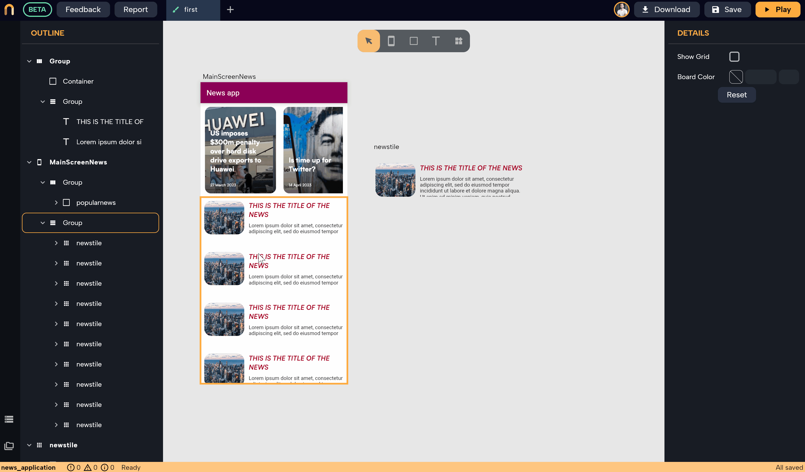

# HTTP GET request

*In this section, you will learn:*
```
1. How to create HTTP GET request 
2. How to connect the API to your UI using the Data Builder widget
```

Nowa provides multiple options to connect your data source, and one of the most popular methods is the traditional HTTP API request. In this guide, we'll show you how to create HTTP GET requests and connect them to your UI, all without writing a single line of code or building any logic with Circuit.

## Creating a GET Request

1.  Click on the **Data Sources** icon in the bottom left corner and choose **API**.
2.  Click **Add** to create a new request, then a popup will appear.
3.  Select the request type (GET, POST, etc.) and enter the API URL.
4.  Click **Go** in the Test section to test the API and see the received data. Nowa will automatically generate the schema based on the test results and create new objects to arrange the data.


### Example: GET Request to Load News from Airtable

Notice the schema generated by Nowa. It creates a top-level object called "myAPIObj1" (your request name + Obj) that holds the top-level JSON object containing all data received from the request. Nowa also creates objects for unnamed JSON objects, such as **myAPIObj_records1**, which represents each JSON object in the **records** list, with each object representing a single news item.


---


## Connecting the GET Request to the UI

To connect the request to the UI, we use a wrapper called **Data Builder**. This wrapper manages the entire connection with the API, firing the request when the widget loads on the screen and passing the received data to all child widgets. While loading the data, it displays a customizable loading indicator.

### Example: Wrapping a Row Group with Data Builder

1.  **Wrap the group** (row) that will display the news **with a Data Builder widget.**
2.  **Choose the name of the API request** in the **Source** field.
3.  **Choose a loading indicator widget** to display while the data is being loaded.
4.  Click the brush icon next to the loading widget to modify it, for example, adding an Align wrapper to center-align the loading indicator.



Any widget underneath the Data Builder wrapper, starting from the group in that example and any widget under it, can access the object **"myAPIObj1"** which represents the data loaded from the request. Inside that object, there's a variable called **records** that holds the list of news. To learn how to display the list in the UI, check out [Creating and Displaying Lists](../variables/lists.md).


