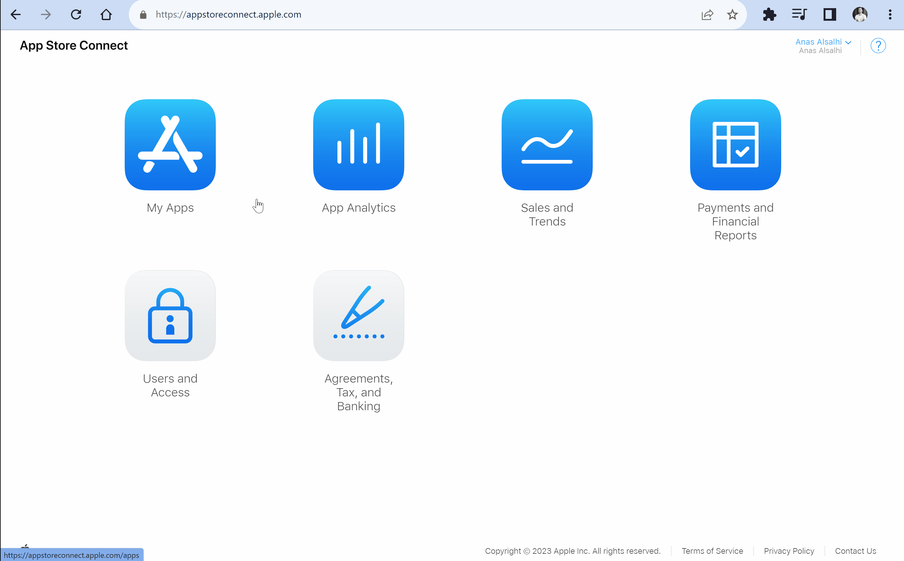

*In this guide you will learn:*

1. Create a bundle identifier for your app
2. Create a new app in App Store Connect
3. Generate an API key for Nowa to deploy your app on your behalf
4. Build and deploy your app to the App Store for the first time

After building your app with Nowa, you can deploy it to iOS devices and publish it to the App Store. The process is straightforward and can be done in a few steps.

## Pre-requisites

Before you can deploy your app to the **App Store**, there are a few things you need to set up:

- **Create an Apple Account:** If you don't have an Apple account, you need to create one [here](https://appleid.apple.com/account?appId=632&returnUrl=https%3A%2F%2Fdeveloper.apple.com%2Faccount%2F).
    
- **Enroll in Apple Developer Program:** Next, sign up for the [Apple Developer Program](https://developer.apple.com/programs/enroll/). This membership, which costs $99 per year, enables you to publish your Nowa-built apps to the App Store.
    
- **Update App Details:** You can set your app's icon and package name in Nowa by going to **Settings > Project Details**.

:::info
The app icon should be a square image with a minimum resolution of `1024x1024` pixels.

The package name should follow the format `com.yourcompany.yourappname` and must be unique across the App Store.
:::

:::tip
Keep a note app handy to jot down important information during the initial setup process, such as your Bundle Identifier and API key details.
:::

## 1. Create a Bundle Identifier

A Bundle Identifier is a unique identifier that distinguishes your app from all others on the App Store. The Bundle Identifier should exactly match your app's package name in Nowa. Follow the below steps to create your bundle identifier:

1. Find your app's Bundle Identifier in Nowa by going to **Settings > Project Details**. It should be in the format `com.yourcompany.yourappname`.

<video src="/videos/ios_deploy/bundle_id.mp4" controls width="100%" />

2. Go to your [Apple Developer Account](https://developer.apple.com/account).
3. Under **Certificates, IDs & Profiles**, select **Identifiers**.
4. Click on the **+** button to create a new identifier.
5. Select **App IDs**, then click **Continue**.
6. Select **App** and click **Continue**.
7. Enter the required information for your new Bundle ID:
    - **Bundle ID**: Use the same Package Name that your app has in Nowa.
    - **Description**: Provide a brief description of your app (this will be visible on the App Store).
    - **Capabilities**: Select the capabilities required for your app (for instance, if your app uses Apple Sign In or Apple Pay, ensure to check the corresponding boxes).

<video src="/videos/ios_deploy/create_bundle_id.mp4" controls width="100%" />

## 2. Create a New App in App Store Connect

[App Store Connect](https://appstoreconnect.apple.com/) is a platform you use to submit new apps to the store and manage their listings. Follow these steps to create your new app:

1. Go to [App Store Connect](https://appstoreconnect.apple.com/) and select **My Apps**.
2. Click on the **+** button next to apps, then select **New App**.
3. In the popup, fill in the following fields:
    - **Platforms**: Choose **iOS** for a mobile app.
    - **Name**: Enter your app's name as it should appear on the App Store.
    - **Primary Language**: Select your app's main language.
    - **Bundle ID**: Select the Bundle ID created in Step 1.
    - **SKU**: Enter a unique ID for your app. This won't be visible on the store. Typically, you can use the same Bundle ID here.
    - **User Access**: If your App Store Connect account includes other users, select who will have access to the app.

Click **Create** once you're done.

## 3. Generate an API Key

To enable Nowa to deploy your app to the App Store Connect account automatically, you need to generate an API key. Here's how:

<video src="/videos/ios_deploy/create_api_key.mp4" controls width="100%" />

1. Go to your [App Store Connect](https://appstoreconnect.apple.com/) account.
2. Select **Users and Access**.
3. Select the **Integrations** tab.
4. Copy the **Issuer ID** from the top of the page, you will need it later.
5. Name your key. This name is for your reference only.
6. Specify the **Access** type associated with this key.

:::info
It should be either **Admin** or **App Manager** for Nowa to be able to deploy on your behalf.
:::

7. Click **Generate** and scroll to the newly generated API key in the list.
8. Click **Download** on the key's row to download private key file and note down the path where you saved it.

:::warning
Make sure to download the API key and store it securely. You won't be able to download it again, and if you lose it, you will need to generate a new one and update the key information in Nowa.
:::

9. Copy the **Key ID** from the key's row, you will need it later.

## 4. Build & Deploy Your App

Now that you have all the necessary information, you can go back to Nowa and build your app for iOS. Before you start the build process, you will need to provide the API key information you generated in the previous step.

:::info
To deploy your app to the App Store, you need to have an active Apple Distribution Certificate account. You can either use an existing certificate or let Nowa generate a new one for you during the build process.

To understand more about the Apple Distribution Certificate, check out [this section](#apple-distribution-certificate).
:::

With your project open in Nowa, follow these steps:

<video src="/videos/ios_deploy/start_build.mp4" controls width="100%" />

1. Click on the **Settings** icon (`⚙︎`) in the top right corner of the screen. This will open the App Settings menu.
2. In the left sidebar of the App Settings menu, slightly scroll down and click on the **Mobile** tab under **Deployment**.
3. Under the **iOS** section, choose **Release** as the build type and scroll down to the **Distribution Certificate** section.
4. Either upload an existing `.p12` private key file associated with your Certificate or let Nowa generate a new one for you.
5. Fill in the required fields with the API key information you collected previously and click **Save**:
    - **Key ID**: The Key ID of your API key.
    - **Issuer ID**: The Issuer ID of your API key.
    - **Private Key**: Click **Browse** to upload the private key file (`.p8`) you downloaded in the previous step.
6. After saving, scroll up to see the **Start New Build** section, and select the branch you want to build from.
7. Click on the **Build** button to start the build process.
8. Once the build is complete, you can find the app in your [App Store Connect](https://appstoreconnect.apple.com/) account under **My Apps**.

## Apple Distribution Certificate

The Apple Distribution Certificate is a critical piece of digital authentication that every developer or organization needs when distributing an app through Apple's various platforms. It verifies your identity, proving that the app comes from you and has not been tampered with since you signed it. Here's everything you need to know about it:

### What is it?

Think of the Apple Distribution Certificate like a digital signature for your app. It ensures that you are the only one who can update or modify your app. It's used across iOS, iPadOS, macOS, tvOS, watchOS, and visionOS, allowing you to sign any app, for any of these platforms.

### How is it used with Nowa?

Nowa offers you two choices. You can either use an existing Apple Distribution Certificate available in your Apple Developer account, or you can let Nowa generate a new one for you.

### How is it usually created?

Typically, an Apple Distribution Certificate is created by making a Certificate Signing Request (CSR) from your Mac. This process generates a private key associated with the certificate. You then upload the CSR to your Apple Developer account to generate the Apple Distribution Certificate.

### How to use an existing certificate?

If you already have an Apple Distribution Certificate, select the **Upload a key** option in Nowa. Then copy and paste the private key value associated with your certificate (open the private key file with a text editor and copy and paste it's content to the field, the same way you did with the App store connect private key). Nowa will then automatically use the private key to pair with the correct Apple Distribution Certificate that's already in your account to sign your app.

### How to generate a new certificate?

If you don't have an Apple Distribution Certificate, select **Generate a new key** in Nowa. This process creates a new certificate in your Apple Developer account. Once created, you can download the private key associated with the certificate so you can use that same certificate to sign other apps, or you can delete the private key generated by Nowa, note that deleting the key inside Nowa only removes the private key from Nowa servers, but not the entire certificate from your Apple Developer account. To remove the complete certificate, navigate to **Certificates** in your Apple Developer account, choose the certificate, and click **Revoke**.

:::warning
Apple limits you to a **maximum of three certificates in your account.** If you reach this limit and choose to generate a new key in Nowa, **your app signing will fail during the build process**.

For this reason, we recommend using a single certificate to sign all your apps. If several developers share the same account, each can use their own certificate up to the maximum of three. If you have more than three developers, we recommend sharing certificates between developers.
:::

:::caution
It's crucial to use the same certificate for all updates to your app. If you try to push an update using a different certificate, it will be rejected. Whichever certificate you use to push the first version of your app, be sure to continue using that one for all updates.
:::
