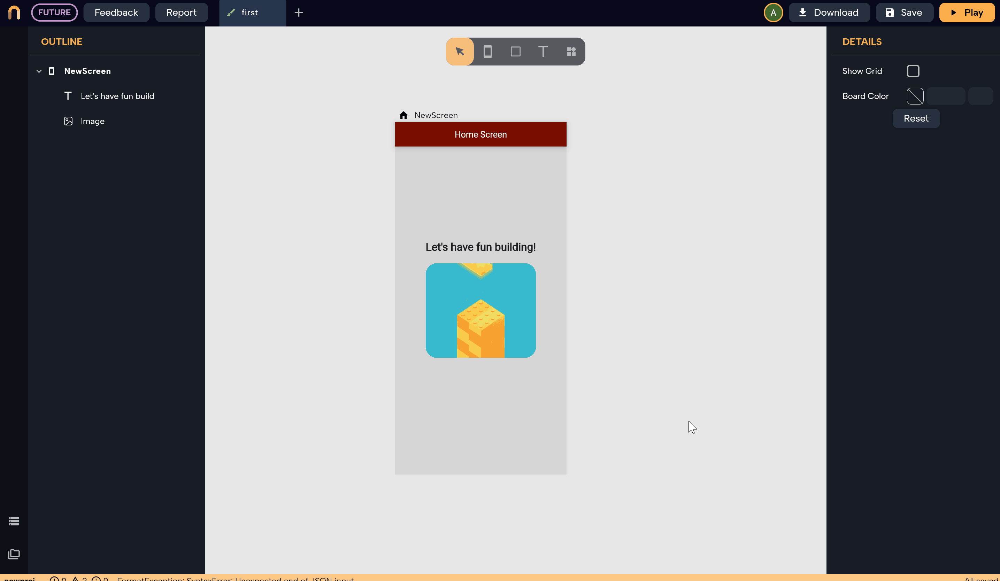
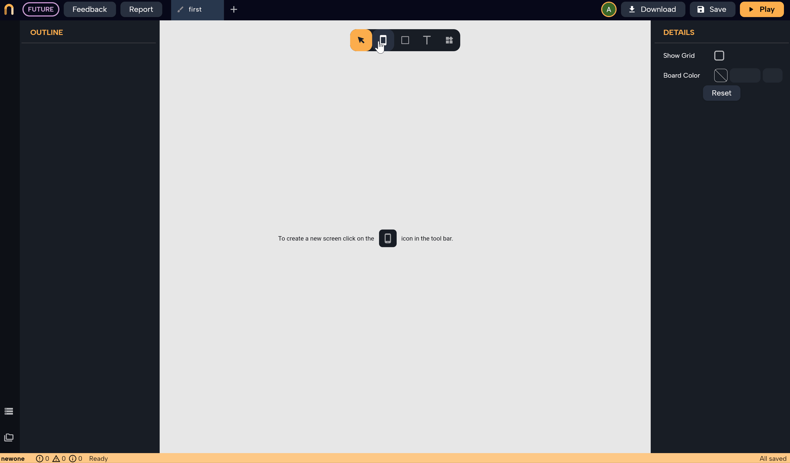

# Getting started

Seems you are excited to try Nowa 🔥But before anything, let us walk you through Nowa quickly. I promise you it will be fun. 

In this tour, you will:
> 
1. Create a new project in Nowa
2. Get to know Nowa's main tools and interface
3. Create your first simple app 

So let's go:

## Creating a new project

After signing in, click on `Create` on the top right to create a new project.
Choose `Cloud` to save the project on the cloud, then simply enter the name of the project.

:::note
Local projects are available with the Desktop version, which is coming soon 🌠
:::

:::info
only small letters and underscores are allowed in the project name, it's Flutter rules 
:::

## Let's get to know Nowa from inside

### Nowa's main tools

After creating a new empty project, you will see the following screen:

That's the UI designer where you will be creating the UI for your apps. It contains the following

1. `Tooltip box`: using it you can create `screens`, add `shapes`, `text`, or other widgets

2. `Details panel`: you can customize and control the details of whatever is selected, a screen or a widget. If nothing is selected then it will show the settings for the board itself (color, grid)

3. `Outline`: you will see all the screens and components on the board with their widget tree (don't worry about what is a component, you will get to know it soon!)

4. `Connect to data source` and your `project files` where you can see all the files and boards as well for your project

5. `Logger` where you can see all the messages about the status of your project

6. `The toolbar`: here you can `Download the full source-code`, `play the app`, `Save the project`, `Check your account`, also you can report any problem, or give us feedback (your feedback helps us make Nowa better)

### Create a screen

Just click on the `Screen` icon on the `Tooltip` then choose the dimensions you want (Pixel 3a, iPhone 12 pro, Samsung S22+ )

:::note
don't worry that your app might not look good on other screens than the one you chose, choosing the screen size here is just for you to start designing on, but you can make the design responsive so it looks as you want on every single screen, more on that later. 
:::

But what if you want a custom size? for sure you can, just double-click on the `Screen` icon then drag on anywhere on the board to draw your screen and drop it when you have the size you want.

---

### Add widgets

click on the `Widgets` icon on the `Tooltip` then either drag and drop the desired widget anywhere on the board or just click on the widget to make it appear on the board and drag it later wherever you want

### Use the details panel

The `Details panel` is your weapon in customizing anything in the UI. It shows the details that you can customize for whatever you are selecting at the moment. Either click on the screen, a widget, or on the board itself to customize its details. *(when nothing is selected you will see the board details in the details panel)*.

---

## Create your first app

Enough with the introduction, let's make you build your first app with Nowa within a couple of clicks🫡.

 Your first app with Nowa won't be displaying "Hello world" as usual, by now you are much more advanced than that I believe. So instead we will make an app with two screens where you navigate between them, still super easy right? ✨ 

1. So the first step, of course, is to create two screens. Let's drop them on the same board beside each other, but you can also put each screen on a different board if you want to. After doing so let's drop an `AppBar` widget to the first screen. You already know how to drop a widget on the screen right? awesome. After that, double-click on the text inside the AppBar to change it to "Home screen".  You can also customize the AppBar to change its background color, the position of the text, etc. All of this is done using the? yes you got it right, the `details panel`.

2. Next step is to make the first screen the home screen of the app, which means whenever you press play, or when your user opens the app, this will be the first screen to be shown. To do so just select the screen and click on `Make home screen` in the `details panel`. After that drop a `Button` widget on the home screen and change its text to "Go to settings" by double click on the text inside the widget, or by selecting the widget then change the button text in the details panel.  

3. Now let's drop an AppBar as well on the second screen and call it "Settings", for example, the same way we did with the first screen.

4. Now let's start the fun part: Making it work! We want the home screen to navigate to the settings when the user press on the button, so we are looking to add functionality for the  `on press` event for the button widget. To do so select the button widget then go to `On pressed` in the details panel, then click on the plus button to add functionality to that event. 

5. You will see a popup, that's called `Circuit ⚡`, which is Nowa editor for creating custom functionality visually. To open it in a full tab, click on the arrow on the top right of the popup. Let's now make the navigation work! Click on the plus button beside the "On pressed" function box to connect it to another box and create the flow of the logic. From the popup, choose the "Nowa" category, which has general functionality boxes, then choose "Navigate" to add a navigation box. Inside the new box added, select the screen you want to move to, in the example below, the name of the other screen was "New screen 3". 

That's it! Now press on play to see your app working. You can also change the device to see how your app will look on other screens like iPhones, MacOS, etc.

:::danger

Congrats on creating your first app, that's your first step into becoming a master in creating great apps with Nowa 🔥

:::
