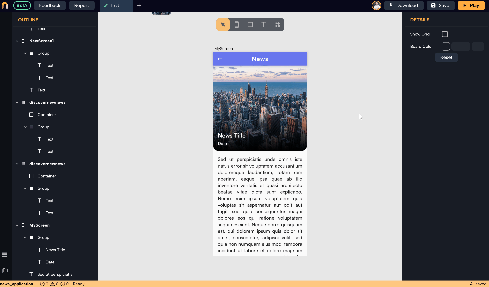

# Variables


In this section, you will learn
```
1. How to create, remove and modify variables 
2. Learn about variables' different properties
3. Learn how to use variables in Circuit to update the state of the app
```

## What are variables and why do we need them?
Variables are the magicians that bring your app's user interface (UI) to life, transforming static designs into interactive experiences. Without variables, your app would be like a pretty painting, nice to look at, but not very useful. 

Variables allow you to update UI properties such as texts, colors, ...etc according to certain logic and/or according to certain data that the app receives.  


Let's dive into creating and managing variables in Nowa!

## Creating Variables

First of all, variables can be added to any screen or component you have in your project. To add variables, there are two methods to do so:

1.  **By adding variables to a screen or component, then connect them to the property**: Select the screen/component you wish to add a variable to > scroll down to the "Variables" section > click on `+` to add a variable> include the name, the type, the default value of the variable> click on "Create". 
 
After doing so, you have a variable in your screen/component that can be accessed from any property for any widget in that screen/component. To connect a property to that variable, Select the widget in that screen/component > click on the property name in the details panel > choose the variable in the list


:::caution

When connecting a variable to a property, be sure the type of the variable matches the type required by the property. An example: for `Image URL` property for the image widget, the variable connected to it should be a `String` 

:::
  
  
2.  **Create a variable directly from the property itself**: Click on the property name in the details panel > choose "Create Variable." > Choose the name and other properties for the variable. The variable will be automatically added to the screen or component and connected to the property. 



We recommend using the second method, it's faster and easier since it automatically sets the variable type to match the property's accepted type and assigns the original value of that property as the default value for the variable.


### Detaching Variables

To detach a variable, click on the property name that is connected to a variable> click on "Detach."

### Creating Lists

To create a list of a certain type, choose the "List" option when selecting the data type of the variable.


## Variable Properties

When creating variables, you will find some properties such as:

### Read-Only Variables

The variables that change during runtime from within the screen/component itself are called state variables, and to set up a state variable uncheck the "Read-Only" option. This allows you to set the variable to a different value within a logic that can be set using **Circuit** and refresh it to update the UI during the running of the app. For example, if you have a variable called "color" and this variable is connected to the background color of a **Container** widget inside the same screen, the variable "color" is a state variable because when clicking on the button, you want the logic attached to the button to change the variable "color" when the user clicks on the button and hence update the background color of that container during the running of the app. If the "Read-Only" option is checked for that "color" variable, you won't be able to change the variable by clicking on the button, you only can use the variable as input from another screen and cannot change its value afterward within the component/Screen itself.

To explain the difference better, let's say you have a screen to show a piece of single news with an image widget and text widgets for the title and the content. The variables connected to those widgets can be "Read-only" even though you won't set them by yourself (the data for the image, title, and content will be loaded from a data source like HTTP GET request). The reason is that the value of those variables will be set as soon as the screen gets created when the user opens it, and afterward, the values of the variables won't change while the user is on that screen. In case you have a button inside that screen or logic to change one of those values while the user is on it, that variable is a state variable, but if the value won't change after being set to its initial value when that screen instance is created, then it's not a state variable.

You might say "But the same screen will display different news according to what the user will click on", even if that screen will be reused to display another news if the user went back to the main screen that displays all the news and then clicked on another news, a new instance of that screen will be created with the new piece of news being set as the initial value of the variables on that screen (title, image, content), so they aren't a state variable because the variables on the same instance of the screen won't change after being set.  

:::tip

Think of it this way: if a variable if "final", meaning its value will be set initially with the creation of the screen/component and won't change later, then it's a "read-only" variable, otherwise if it is intended to change after its initial value was set, then it's a state

:::

### Private Variables

By making a variable private, you prevent it from being accessed outside its parent screen or component. This ensures that the variable's scope is limited to the screen or component it belongs to, maintaining encapsulation and reducing the risk of unintended interactions.

For example choose **private** option for a variable if you want it to only be set or changed within the same screen/component itself without any interaction from outside, such as another screen. By doing that, the variable won't be even visible outside that screen/component and hence the value can't be set or changed from outside.  

In summary, variables in Nowa are crucial for bringing your app to life by adding logic and functionality to the UI. By following this guide, you can create and manage variables in your Nowa app with ease.

