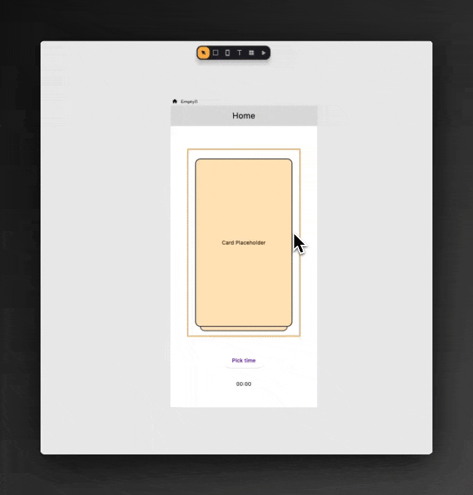

# 📰 What's new 

> Discover the latest features and enhancements for each version of Nowa. For more details, check the [changelogs](./change-log.md)

---

### **3.6 (6 March 2026)**
Nowa 3.6 brings a big boost to what you can do. Now you can offer **in-app purchases with RevenueCat**, use **Planning Mode** to get much more accurate results from AI, get solid results for complex prompts in **Agent Mode**, and more improvements to make your day-to-day building smoother.

Want to see everything in action? Watch the Dev Diary:
  <iframe width="767" height="431" src="https://www.youtube.com/embed/dLsO05crdSk" title="Nowa 3.6 | Dev Diary" frameborder="0" allow="accelerometer; autoplay; clipboard-write; encrypted-media; gyroscope; picture-in-picture; web-share" referrerpolicy="strict-origin-when-cross-origin" allowfullscreen></iframe>

#### **New in This Version ✨**
- 💰 **In-App Purchases with RevenueCat**
  You can now add in-app purchases to your iOS and Android apps with just a few clicks through **RevenueCat**. If you've been wanting to monetize your app, this is the easiest way to get started. A step-by-step tutorial is coming in the next few days.

- 🧠 **AI Planning Mode**
  Instead of jumping straight into implementation, **Planning Mode** takes the time to understand what you're trying to build, analyzes your project in depth, asks you the right questions, and lays out a clear plan for you to review before anything gets implemented.
  You can keep refining the plan until you're happy with it, then let it build — so you get what you actually wanted without the back and forth.

- ✅ **Todos in Agent Mode**
  For complex requests and long prompts, the agent now creates its own **internal todo list** and works through tasks one by one, allowing it to stay focused and produce much better results along the way.

- 🔍 **Smarter Search**
  The AI agent is now much more efficient at searching across your project, making your prompts **faster** and **lighter on credits**.

- 🔬 **Source-Code Analysis**
  The agent can now trigger **deep analysis** directly on the source code to catch problems there, making it way more reliable at debugging and able to detect all kinds of issues.

- 📋 **Automatic Issue Reporting**
  If the AI runs into something unexpected, it reports it directly to us and shares a **report ID** with you to follow up. No personal data is collected — this just helps us support you better if something happens.

- 🔐 **Google Sign-In with Supabase**
  You can now implement Google Sign-In using Supabase easily. Just connect your project to Supabase and ask Nowa AI to set it up for you.

- 🎓 **Onboarding for New Projects**
  Starting a new project? You'll now get a guided **onboarding experience** to help you get up and running quickly.
  

#### **Community Highlights 🌟**
- 🇸🇪 **[Klubbrabatten](https://klubbrabatten.se/)** — Sweden's biggest loyalty rewards program, giving users discounts across restaurants and places all over the country. Used by over **150,000 users** and built entirely with Nowa and Supabase.
- 🏋️ **[Zero-Trust Fitness App](https://github.com/EdoSag/Zero-Trust-Fitness)** — an open-source, privacy-first alternative to Google Fit that encrypts all your health data, built by **Edo**. Want to contribute? Clone the project and jump in!

➡️ If you face any issue, use the **"Problem"** button to report it (attach a project snapshot if needed), or email us at `team@nowa.dev`.

---

### **3.5 (9 February 2026)**
Nowa 3.5 is a big step forward. In this release, you’ll get **Nowa Agent V3** (a new AI foundation), a new routing system powered by **GoRouter**, **Git support for Local Projects**, and smoother performance across the editor.  

#### **New in This Version ✨**
- 🤖 **Nowa Agent V3 (4 modes)**  
  This is the biggest change in 3.5 — we rebuilt how AI works in Nowa.  
  
  You now have four modes to choose from: **Instant, Thinking, Deep Thinking, and Max**. The new modes (except Max) consume **5× fewer credits**, run **4× faster**, and produce **2–3× better results**.  
  
  In practice, you’ll notice:  
  - Better UI/UX generated out of the box  
  - Stronger Supabase workflows using **Supabase MCP** (including more complex cases)  
  - Better planning and debugging for bigger tasks  
  - Deeper understanding of Nowa projects and newer Flutter capabilities  

- 🧭 **Routing is now GoRouter by default**  
  All new projects now use **GoRouter**. Each screen has a **path**, so your web apps can navigate with real links and URLs, and your mobile apps can support **deep linking** (for example from notifications).  
  It also makes building navigation patterns like **Navigation Bars** and **Drawers** much simpler and cleaner.  

- 🌿 **Git for Local Projects**  
  Local projects now come with **Git enabled by default**, so you can track changes, discard them when needed, commit your work, review history, and push to GitHub (or any Git provider) — just like a real production workflow.  

- ⚡ **Smoother UI boards**  
  We improved how boards are rendered — moving between screens, panning, and zooming should feel **significantly smoother**, even when your board has many screens.  

#### **New Content 📚**
- 🎥 **Dev Diary (Nowa 3.5)**  
  Want to see everything in action? Watch here:  
  <iframe width="767" height="431" src="https://www.youtube.com/embed/CuR6uC32ulE" title="Nowa 3.5 | Introducing Nowa AI Agent V3 | Dev Diary" frameborder="0" allow="accelerometer; autoplay; clipboard-write; encrypted-media; gyroscope; picture-in-picture; web-share" referrerpolicy="strict-origin-when-cross-origin" allowfullscreen></iframe>  

#### **Community Reward 🎁**
- 🎁 **Get 50 free AI credits**  
  Share a **complete app** you built and deployed with Nowa on **LinkedIn or X**, tag us, and you’ll get **50 free AI credits**.  
  The **top 5 apps** shared will get **1 month free on the Scale plan** (and if you’re already on Scale, you’ll get a refund for that month).  

➡️ If you face any issue, use the **"Problem"** button to report it (attach a project snapshot if needed), or email us at `team@nowa.dev`.  

---

### **3.4 (19 January 2026)**  
This is one of our biggest releases yet — introducing **Supabase MCP** and a new **Agent Creation Summary** for faster, clearer AI workflows.  

#### **New in This Version ✨**
- 🧠 **Supabase MCP (Frontend + Backend from one panel)**  
  From now on, building a serious full stack app has never been easier! With Supabase MCP, Nowa agent can manage your full backend besides the frontend, allowing you to build the app you want with way less effort.
  
  Connect your Supabase project and let the AI Agent set up everything end‑to‑end such as:  
  - Create tables and database structure  
  - Generate RLS policies  
  - Set up triggers and Edge Functions  
  
  To use it, enable Supabase MCP it in the agent chat, then describe what you want and let the agent do the full work for you!  

- 📋 **Agent Creation Summary**  
  After each AI chat, you’ll now see a summary box showing **everything the agent created**.  
  - Drag and drop items to the board  
  - Click any item to preview it in the file viewer  

- 🎥 **New Tutorials**  
We have released the following new tutorials on YouTube:
  - Google Maps integration: https://www.youtube.com/watch?v=1aqqNMtRKQU  
  - Instant preview sharing (testing & feedback): https://www.youtube.com/watch?v=ORa4ohpK4pQ  

---

### **3.3.5 (30 December 2025)**  
Say hi to **Commit History, one‑click GitHub integration, and faster loading for local projects**. Let's get into details:

#### **New in This Version ✨**
- 🕒 **Commit History in Nowa**  
  You can now browse your **full commit history directly inside the Git panel** without needing GitHub.  
  - Preview all previous commits and see which files were created, modified, or removed  
  - Click any file to inspect **line‑by‑line changes**  
  - Right‑click a commit and choose **“Revert”** to roll back its changes  
  > Note: Commit History is currently available for **Cloud projects**. For Local projects, you can continue using GitHub Desktop, other IDEs, or the command line.  

- 🐙 **One‑click GitHub Integration**  
  Connecting your project to GitHub is now a **single click** away — no manual tokens required.  
  - Go to `Project Settings → Git → Connect to GitHub`  
  - Authenticate Nowa in the window that opens  
  - Return to Nowa and you’re connected, ready to push and pull from your repository  

- 💽 **Faster Loading for Local Projects**  
  Local projects with lots of dependencies now **load much faster**.  
  - Nowa 3.3.5 uses your **local Flutter SDK** to resolve dependencies  
  - This removes the need to fetch them all again from `pub.dev`, especially for large projects  

---

### **3.3.2 (10 December 2025)**  
Say hello to **Google Maps in Nowa!** This update brings new power to your apps with built-in Maps support, along with smoother performance across the board.  

#### **New in This Version ✨**
- 🗺️ **Google Maps Widget**  
  You can now add and customize **Google Maps** directly inside Nowa — no need for custom code!  
  - Add from the **Widget Picker**  
  - Configure it visually or through AI  
  - Run it in the simulator to view live map results  

#### **Improved Experience ⚡**  
- Better loading visuals when opening projects for more transparency.  
- More consistent UI rendering when switching between screens and views.  

#### **Coming Soon 🔮**
- 🧩 **Supabase & Figma MCPs:** Connect your backend and design directly into Nowa.  
- ⚙️ **AI Upgrade:** Faster, smarter, and more context-aware AI generation.  
- 🎥 **New Video Series:** Full onboarding and crash course for new users.  

---

### **3.2.0 (14 Novemeber 2025)**  
This update makes Nowa’s AI **smarter, more capable, and fully connected to the Flutter ecosystem** — introducing **AI that can use custom packages from pub.dev!**  

#### **New in This Version ✨**
- 🧠 **AI That Uses Custom Packages**  
  The AI can now **fetch and use packages directly from pub.dev**, reading their docs, understanding their APIs, and implementing them automatically in your project — even if they aren’t built into Nowa.  
  > ⚙️ Enabled by default for new projects  
  > 🧪 For existing ones: Go to `Settings → Packages → Enable “Load Packages (Experimental)”`  

- ⚡ **Smarter, Cleaner AI**  
  The AI now fully understands Flutter’s **Material library** and core widgets — meaning no more “undefined” issues and more precise results.  
  It also uses **new internal tools** to build cleaner architectures, connect logic and UI automatically, and follow your themes naturally.  

- 🌐 **Built-in Cloud Git Integration**  
  Every **cloud project** now comes with **Git pre-configured**.  
  You’ll see visual indicators for pending changes and can commit directly within Nowa to keep your project’s version history clean and easy to manage.  

#### **Coming Soon 🔮**
- 🧩 **Supabase & Figma MCPs:** Build your frontend, backend, and UI all from Nowa AI.  
- ⚙️ **AI Core Boost:** Improving reasoning, context awareness, and result accuracy.  
- 🎥 **Nowa Onboarding Video:** Learn the platform in under 15 minutes.  

---

### **3.1.2 (25 October 2025)**  
A quick update following the 3.1 release, improving the **AI agent experience and reliability** to make working with it smoother and more stable.  

#### **New in This Version ✨**
- 🧠 **Improved AI Stability**  
  The AI now handles larger prompts, streams responses more reliably, and maintains more consistent performance in long chats.  

- 🔗 **Better Sharing Experience**  
  Shared links and public previews now open instantly without login issues.  

- ⚙️ **Improved Bug Reporting Flow**  
  You can now include more context automatically when submitting issues, helping the team fix things faster.  

#### **Coming Soon 🔮**
- 🎥 **AI Quick Guide:** Short video on how to use the new AI agent.  
- 🚀 **Onboarding Walkthrough:** Learn everything new in Nowa 3.1 in minutes.  

---

### **3.1.0 (21 October 2025)**  
This is our biggest update since V3.0 - with a brand‑new AI agent, Cloud Local Sync, Instant Sharing, and major performance upgrades.  

#### **New in This Version ✨**
- 🧠 **New AI System**  
  Rebuilt from the ground up for speed, stability, and much better results.  
  - The new agent is simply ⚡ 4× faster with 3× better results than the previous one   
  - 💬 Stream Mode: You can see the results now live in real time  
  - 🔧 The Agent checks for it's results and fix them on the spot with the same prompt   
  - ❓ It Asks clarifying questions when it's unsure instead of making assumptions, leading to results that are more of what you expect.  
  - 🎮 It can run the app automatically to test and catch runtime issues and fix them  
  - 🗂 You have now Chat history saved per project to resume any previous conversation with its full context  
  - 🎯 We changed the usage tracking from per-prompt to a wew credit system that relies fully on tokens for more fair use. (e.g., ~0.1 credit for redesigning a card components, ~1 credit for generating a full funtional screen). You can see the credit consumption for each prompt and for the overall chat as well. In settings you will see a history for your AI consumption.

- ☁️ **Cloud + Local Sync**  
  No need to choose if your project should be a local or cloud one. The same project can live on both now, with you being able to sync them with a click (no Git needed). 
  Simply inside your project, click on the `Settings` icon -> `Project Sync`, and there you will be able to sync a cloud project to local or vise versa.

- 🔗 **Instant Preview Sharing**  
  You can now share the instant preview that you use inside Nowa with others! Simply click on the share button on the toolbar inside Nowa to share the instant preview privatly (with people in your workspace) or publicly with anyone.
  They will be able to view the app as well insantly without building.
  Compare to deploying to Web, this allows you to share without even the need for hosting for faster sharing from your side and faster viewing from the other side.

#### **New Content 📚**
- 📘 **New Docs:**  at [docs.nowa.dev](https://docs.nowa.dev)  
- 🌟 **Showcase Page:** at [nowa.dev/showcase](https://nowa.dev/showcase) 
- 🏢 **Nowa Agency:** You can make our team build your full app and handle it in Nowa. 50% cheaper and 3x fastet than other agemncies. [Apply here](https://forms.gle/2VbmrP3tUMfkrGjP8)

#### **Coming Soon 🔮**
- 🧩 You will be able to any package from pub.dev directly in Nowa without even using custom code  
- 📥 Importer V2: You will be able to import any Flutter project even the ones built outside Nowa  
- 🧠 AI Planning Mode: the AI agent will be able to make a dynamic plan for complex prompts for better results when it comes to app-level prompts.  

➡️ Please keep using the in‑app Feedback button to report issues or share ideas — it helps us make Nowa better much faster :)  

---

### **3.0.10 (7 October 2025)**  
We excited to introduce two powerful new features — **Notifications** and **Supabase Storage** — plus a brand-new syncing system between Nowa and your code files, that makes building smoother than ever.  

#### **New in This Version ✨**
- 🔔 **Firebase Notifications:**  
  You can now offer **real-time notifications** in your app with few clicks! Once you connect your project to Firebase, you can send messages from the Firebase panel, from Nowa, or even through APIs like Supabase Cloud Functions. Enable it from Firebase settings in your project.

- ☁️ **Supabase Storage:**  
  You can now **store and retrieve files** from Supabase Storage — this, along side using Supabase Auth and tables in your app, makes it possible to build a full functional apps where data and assets are binded to specific users.  

- 🔄 **Smarter Code Sync:**  
  The new sync system makes working with code feel seamless.  
  Every change updates instantly in your UI without the board refreshing or repositioning for items, make it feel super natual to work with code files alongside Nowa  

#### **Content 📚**
- 📘 **Docs for Nowa 3.0 are Live!**  
  The documentation has been fully updated to focus on Nowa 3.0, with also new sections regarding using Nowa AI, APIs, Supabase, local projects, and more.  
  👉 Explore it here: [docs.nowa.dev](https://docs.nowa.dev)  

- 🎥 **New Tutorial:**  
  Learn how to build a beautiful **Movie App** using Nowa and APIs — [Watch Part 1](https://www.youtube.com/watch?v=COpngAiqm0o). You can [try the app yourself here]()

#### **Coming Soon 🔮**
- 🚀 **Nowa 3.1:** Our biggest update since 3.0 — featuring a more stable AI, restore points, chat history, a token-based credit system, and instant Cloud + Local sync.  
- 🌟 **Showcase Page:** Discover real apps built with Nowa, complete with live demos.  
- 🏢 **Agency Program:** Special deals and support for development agencies — reach out to `team@nowa.dev` to know more!  

➡️ If you encounter any issues, please report them using the **in-app Feedback** button — it helps us improve it for you pretty fast.  

---

### **3.0.9 (19 September 2025)**  
Nowa 3.0.9 is a small but important update focused on **fixing some issues** that improve reliability and usability.  
Check all fixes in the [ChangeLog](./change-log.md).  

---

### **3.0.8 (17 September 2025)**  
Nowa 3.0.8 introduces **new templates, workflow improvements, and key fixes** to make your building experience smoother and more reliable.  
Check all details in the [ChangeLog](./change-log.md).  

---

#### **Fixes & Improvements 🛠**  
- 🧩 Added **new stunning templates** that match the quality of Nowa 3.0 — replacing the old ones with fresh, modern designs.  
- 🎨 Removed the older way of changing themes to simplify the workflow.  
- ⚠️ Error build design is now clearer and clickable, so you can quickly access build logs when needed.  
- 📑 Added the option to **include cloud build logs** when submitting bug reports — making issue reporting faster and debugging easier.  

---

#### **Coming Soon 🔜**  
- 🤖 A **new AI system** that feels smoother, produces better results, supports packages, writes custom code, and fixes issues automatically.  
- ☁️ **Unified Local & Cloud projects** — no more choosing between them. You’ll get deploy, simulator testing, and hybrid workflows in one.  
- 🎨 Any **AI output will soon be fully visually modifiable**, giving you total creative control.  
- 🎥 **New tutorials**: building a **Movie App** and a **Mental Health App** using Supabase + ChatGPT.  
- 📘 **Brand-new Docs** for Nowa 3.0.  

➡️ If you encounter any issues, please report them using the **in-app Feedback** button — it helps us resolve problems faster.  

---

### **3.0.6 (9 September 2025)**  
Nowa 3.0.6 is a stability-focused release, fixing several important issues to make building, previewing, and deploying your projects more reliable.  
Check all fixes in the [ChangeLog](./change-log.md).  

---

#### **Coming Soon 🔜**  
We’re preparing fresh resources and features to help you get the most out of Nowa 3.0:  

- 🎥 **Video Tutorial:** Build a full AI-powered app with ChatGPT + Supabase that collects your mood and feelings, then analyzes them like an expert.  
- 🎬 **Video Tutorial:** Build a beautiful Movie App from scratch using APIs.  
- 📘 **New Docs** for Nowa 3.0 with a clearer structure and guides.  
- ⚡ **Live Streaming AI Results** — watch the AI generate results in real time inside the builder.  

➡️ If you encounter any issues, please report them using the **Feedback** button inside Nowa. This helps us quickly track and resolve problems.  

---

### **3.0.4 (29 August 2025)**  
Nowa 3.0.4 is a stability-focused release that resolves several important issues and makes the AI agent more reliable. Alongside the fixes, we’ve also added **new learning resources** to help you explore what’s possible with Nowa 3.0.  
Check all details on the [ChangeLog](./change-log.md).  

---

#### **New Learning Resources 📚**  

🎧 **Build a Music Player with Nowa 3.0 Agent**  
Step-by-step video tutorial showing how to create a music player app powered by the AI agent.  
**[Watch here →](https://www.youtube.com/watch?v=kXfqaZSzG0g)**  

📝 **Build a To-Do App with Supabase**  
Learn how to connect Supabase Auth and database tables in Nowa to create a functional to-do app.  
**[Read the blog →](https://blog.nowa.dev/build-todo-app-with-supabase-nowa-3)**  

🧠 **Master Prompting with Nowa AI**  
A practical guide to writing prompts that produce accurate, connected, and production-ready results.  
**[Explore the guide →](https://blog.nowa.dev/nowa-ai-prompting-guide)**  

---

#### **Coming Soon 🔜**  

We’re preparing a series of **fully functional app tutorials**, including:  
- 💸 Financial Tracker App  
- 🏋️ Workout Planner App  
- 🤖 AI-Powered Chat App  
- 📝 Note-Taking App with Supabase  

These apps will be released in the coming days, complete with **step-by-step tutorials** so you can build them too.  

➡️ Don’t forget to use the **Feedback button** for any ideas or issues — it helps us make Nowa better for you.  

---

### **3.0.2 (12 August 2025)**  
Nowa 3.0.2 is a stability-focused update, fixing several important issues to make building, deploying, and loading your projects more reliable. Check them on [ChangeLog](./change-log.md) 

---

### **3.0.1 (11 August 2025)**  
Nowa 3.0.1 focuses on **improving stability, fixing key issues, and adding new resources** to help you get the most from Nowa AI.  

#### **Fixes & Improvements 🛠**  

💻 **Desktop App Access Restored**  
The desktop version is now correctly available for all plans.  

📄 **Board Naming Fixed**  
New boards now use the name you assign — no more generic `board*.board` names.  

🍏 **AI on macOS Restored**  
Resolved an issue where AI wouldn’t run on certain macOS versions due to file creation errors.  

#### **New Learning Resource 📚**  
📝 **How to Write Prompts That Build Better with Nowa AI**  
Learn practical techniques to get **more accurate, connected, and production-ready results** from your AI agent.  
**[Read the guide →](https://blog.nowa.dev/nowa-ai-prompting-guide)**  

#### **Coming Soon 🔜**  
🎥 **Video Tutorial:** Building a **Music Player App** from scratch with Nowa AI, using Supabase/API as data sources.  
📝 **Blog:** A deep dive on how to use the **Nowa AI agent** effectively.  
🤝 **Cobuild & Launch:** We’ll help you **build and launch** your app — from idea to production.  

➡️ If you encounter any issues, please report them using the **in-app Feedback** button. Including your project (and AI history if relevant) gives us the best context to fix them quickly.  

---

### **3.0.0 BETA (4 August 2025)**  
Nowa 3.0 is our biggest release ever — packed with powerful AI features, backend upgrades, and a refreshed builder experience. Let’s dive into what’s new!

#### **New ✨**

🤖 **AI Agent for Building, Editing, and Debugging**  
Generate entire screens, features, or app flows with a single prompt.  
You can now:
- Build new widgets and screens instantly
- Edit or fix parts of your app with or without selecting anything
- Prompt across multiple screens — the AI understands what to connect

🛠 **Supabase Integration (Beta)**  
Build full-stack apps faster with native Supabase support:
- Authenticate users with **Supabase Auth**
- Use AI to generate queries
- Enable **row-level security** for production-ready apps

🎨 **Redesigned Theme System**  
Access the new theme editor from the left bar.  
Create, preview, and manage design tokens visually — no more guesswork when styling your app.

🧭 **Upgraded Builder Experience**  
Enjoy a smoother and more powerful editing experience:
- Visual **Component Explorer** — inspect and highlight widgets across your app
- Improved **Boards** — navigate your screens with better layout and structure

#### **Plans & Access 💼**

We’ve made our pricing more accessible — with powerful features available to everyone.

🆓 **Free Plan (Starter)**  
- Unlimited code exports  
- Unlimited projects  
- Desktop version + local development  
- Web publishing for 12h (testing)  
- 5 AI messages/month  

🚀 **Launch & Scale Plans**  
- Up to **200 AI messages/month**  
- Web & mobile deployment  
- GitHub integration  
- Premium support  
- AI credit top-ups

🎁 **Bonus for Existing Users:**  
- Pro users now get 35 AI messages/month  
- Premium users now get full **Scale Plan** access at the original price

#### **Coming Soon 🔜**

🎥 **Tutorial Video:** Watch how to build a full app using the new AI agent  
📝 **Pricing Blog Post:** See what’s included in each plan, with clear use cases  
🤝 **Cobuild & Launch (for Scale users):** Our team helps you build and launch your app — step-by-step, no extra cost

➡️ Found a bug in the BETA? Report it using the in-app Feedback button and earn **extra AI credits** as a thank you!

---

### **2.0.21 (27 May 2025)**  
This update makes managing APIs faster than ever, squashes critical bugs, and sets the stage for the AI-powered future of Nowa. Let’s dive in!

#### **New ✨**  

📦 **One-Click API Imports**  
Skip the manual setup! Import groups of API requests instantly from:
- **Postman**
- **Swagger**
- **Xano**

Simply import, and Nowa automatically handles the rest—endpoints, request types, headers, and body included.

For more, check out [this page](../data-connections/api/createapi)

📥 **Instant cURL Support**  
Paste a **cURL command**, and Nowa turns it into a ready-to-use API request. Less manual work, more building!

#### **Coming Soon 🔜**  
🤖 **AI Assistant (Alpha testing already going!)**  
We’ve begun private alpha testing for our AI Assistant. Soon, you’ll effortlessly:
- Generate entire apps or screens instantly with prompting  
- Edit existing screens and components, and prompt to fix bugs or unexpected behaviours.  
- Connect APIs seamlessly through AI-powered logic.  

The early results are astonishing—combining visual editing and AI is proving incredibly fast and powerful!

👉 [Sign Up for Early Access](https://forms.gle/xNUR7nsYRUz8kpJ67)

---
### **2.0.20 (23 April 2025)**  
This update brings a whole new API workflow, smarter debugging in Play mode, and better defaults across the board. Let’s dig in!

#### **New ✨**  

🧩 **All-New API Editor**  
Managing your APIs just got way more powerful:
- View and manage **all requests in one place**, right next to your files  
- A streamlined flow for creating, testing, and generating models/mock data  
- Supports **form data**—so you can now handle **file uploads** easily  
- Control over **content-type** for each request  

📏 **Smarter Padding Controls**  
Add **Horizontal** and **Vertical** padding directly—cut down the typing, boost your layout precision!

▶️ **Play Panel, Upgraded**  
While testing your app in Play mode, you can now **select elements directly**—making UI debugging a breeze.

💬 **Chat Template Gets a Boost**  
We gave our built-in Chat template some love:
- **Profile component** added for a personal touch  
- **App Bar** now included with account info  
- Input validation prevents sending empty messages  
- Improved naming and structure for easier edits  

🔍 **Better Logic Building in Circuit**  
- Hover on any function to see its **return type**  
- The **search** now includes all **main nodes**, so you find what you need faster

⚠️ **Play Mode Custom Code Warning**  
Got custom functions or widgets? You’ll now see a **warning** when using Play mode, so you know it may use dummy values unless tested on a simulator.

#### **Coming Soon 🔜**  
- 🤖 **AI-generated expressions** — just describe what you need, and let AI handle the logic  
- 📘 **AI-powered Docs Assistant** to help you find answers instantly (currently in BETA)  
- Even more **API upgrades**  
- And… something **BIG** is coming soon 👀

---

### **2.0.19 (6 April 2025)**  
Nowa Marketplace is finally here! 🚀 This update brings you a faster way to build with sample projects, a powerful Git integration, a fresh button widget, and better error handling—all designed to supercharge your workflow.

#### **New ✨**

🛍️ **Nowa Marketplace**  
Introducing our very first **Marketplace**—your new starting point to build faster with real, editable projects:
- Discover sample apps right from the dashboard  
- Preview them, check the structure, and **Add App** to start building  
- View details like APIs, AI, and custom code setups  

We’re launching with:  
- 🧊 **Water Tracker App** – featured in [our latest tutorial](https://www.youtube.com/playlist?list=PLVhnHv8Cdhz87lklVjSao4Y0EHdlq2j5a)  
- 🤖 **AI Chat App** – a complete ChatGPT-powered messaging experience

🔁 **Revamped Git Integration**  
Manage your projects like a pro with full Git operations:
- Clone from any Git provider (like GitHub)  
- Push cloud projects to Git  
- Keep local, cloud, and remote versions in sync  
- Commit, discard, branch—you name it  
[Check out the full Git guide](../git/intro-git.md)

🔘 **New Button Widget**  
Customize your buttons with the all-new `ButtonStyle`:
- Set background color, text style, border radius, elevation, and more  
- Apply a `ButtonTheme` across your app for consistent styling

⚠️ **Smarter Error Handling**  
- Get warnings before layout issues happen  
- Prevent actions that could crash your app  
- Quickly spot and fix problems with **file-specific error messages**

#### **Coming Soon 🔜**  
🍯 Easier API workflows  
🔁 Big improvements to Circuit  
📱 More sample projects  
🎥 Tutorial on building advanced features in the AI Chat App

### **New learning resources**
We’ve added new docs to help you learn and master building with Nowa:

##### 🧬 Hybrid Approach
- [🌿 Intro to Hybrid Approach](../hybrid-approach/intro-hybrid-approach.md)  
- [🧩 Using Custom Code](../hybrid-approach/custom-code)  

##### 🧠 Circuit & Logic
- [🔌 Circuit Intro](../logic/intro-circuit.md)  
- [🔀 If Statement](../logic/control-flow/if-statement)  
- [🧯 Try Catch](../logic/control-flow/try-catch)  

##### 🧭 Common Functionalities
- [🧭 Navigation](../logic/common-functionalities/navigation)  
- [🖼️ Media Picker](../logic/common-functionalities/media-picker)  
- [💻 Check Platform](../logic/common-functionalities/platform-checking)  
- [🖨️ Print](../logic/common-functionalities/print)  

##### 📦 Variables & States
- [🧠 Using Data Models](../vars-params-functions/data-models)  
- [🌍 Global States](../vars-params-functions/global-states)  

##### 🔁 Git & Version Control
- [🔁 Full Git & GitHub Guide](../git/intro-git.md)  

### **2.0.18 (12 March 2025)**  
This update introduces our newest built-in template—**AI Chat**—allowing you to quickly build your own chat-based apps. Plus, we've made navigating your project logic faster and easier!

#### **New ✨**  

🤖 **Chat Template**  
Nowa now includes an **Chat template**, helping you to quickly create a powerful chat experiences in your app:
- Ready-to-use **chat screen** for immediate integration.
- Pre-built components including **chat bubbles** and **chat logic**.
- Fully customizable to fit your own chat use case!
[See how to use it here](../tutorials-template/chat-template.mdx)

🚀 **Quick Navigation to Functions & APIs**  
We've enhanced your workflow in Circuit with **quick navigation**:
- Click the new **"open" icon** next to functions or API request nodes.
- Instantly jump directly to the source, making edits easier and faster.

#### **Coming Soon 🔜**  
- **Sample Projects**: AI Chatbot, To-Do app, and a Water Tracker App!

### **2.0.17 (4 March 2025)**  
This update introduces a major new capability—**Web Deployment**—allowing you to **publish and share your web apps with a single click**. Plus, we've added **new widgets**, improved the dashboard, and enhanced audio support!

#### **New ✨**  

- **Web Deployment**  
  Nowa now allows you to **deploy your web apps online effortlessly**. You can choose between:
  - **Development Mode**: Share a temporary link for testing, available for all users.
  - **Production Mode**: Publish a **permanent live version** (Pro & Premium users only) and even use a **custom domain**.
  - Need to host it yourself? **Download the build files** and deploy them anywhere!
  
Check out the **[full guide on web deployment](../deployment/web-deploy.mdx)** to get started!

- **Badge Wrapper**  
  Introducing the `Badge` wrapper—perfect for displaying **small notifications, labels, or indicators** in your UI. Easily **customize colors, shapes, and text** to highlight important elements.

- **Pin Code Field Widget**  
  Need to collect **secure PIN inputs**? The new `Pin Code Field` widget allows users to enter PINs or OTP codes with a customizable look and feel.

#### **Improvements 🔧**  

- **Dashboard Enhancements**  
  - We’ve **separated cloud projects from local projects**, making it easier to manage your workspace and distinguish between them.

- **Audio Source Enhancements**  
  - Nowa now supports **playing audio directly from bytes**, giving you more flexibility when handling audio playback.

- **Request Templates Directly from the Panel**  
  - Need a specific app template? You can now **request templates directly** from inside the Nowa panel, and we will work on it right away!

#### **Coming Soon 🔜**  
- **Sample Projects**: including a AI-Chatgot, To-Do app, and a Water Tracker App

### **2.0.15 (12 Feb 2025)**  
This update brings exciting new widgets and important improvements to Nowa, including **Swipeable Stack**, **Time Picker**, and various bug fixes.  

#### **New ✨**  

- **Swipeable Stack Widget**  
  Nowa now supports **Tinder-style swiping cards**! Use the `Swipeable Stack` widget to create **interactive swipe effects** for card-based UIs. Simply **connect it to a list variable**, just like ListView, and bring a dynamic experience to your app.  

- **Time Picker**  
  You can now allow users to **select a specific time** in your app! Previously, Nowa only supported picking dates. With `ShowTimePicker`, you can capture user input for time selection and format it easily using `.format()`.  

  
  

---

#### **Coming Soon 🔜**  

- **Web Hosting with Custom Domains**  
  Host your **Flutter web apps** directly from Nowa and set up a **custom domain** in just a few clicks.  

- **AI Voice Assistant App Template**  
  Get a pre-built **real-time AI voice assistant** template, ready to be customized with your own API keys and settings.  

- **VS Code Integration (Planned)**  
  Work with Nowa **inside VS Code** for a seamless hybrid workflow, combining **visual building and coding** in one place.  

---

### **2.0.14 (29 Jan 2025)**  
This update brings a **brand-new dashboard design** and support for the **Intl package for date/time formatting**, improving both usability and localization capabilities.  

#### **New ✨**  

- **New Dashboard Design**  
  We’ve redesigned the dashboard for a **smoother and more intuitive experience**.  
  - Easily navigate between **projects and workspaces**.  
  - Discover the **new Learning Resources section**, where you’ll find top guides, tutorials, and tips to **help you build faster and better**.  

- **Intl Package for Date/Time Formatting**  
  Nowa now supports the **Intl package in Flutter**, allowing you to:  
  - **Format dates, times, and numbers** based on locale preferences.  
  - Easily localize your app with **region-specific date formats, timezone adjustments, currency formatting, and pluralization rules**.  

  ---

### **2.0.13 (4 Feb 2025)**  
This update brings major improvements to Nowa, including **Git integration**, **media picking**, **account management**, and a **new package management system**.  

#### **New ✨**  

- **Git Integration for Cloud Projects (Web & Windows)**  
  Connect your Nowa cloud project to **GitHub (or any Git service)** to **commit, push, pull, switch branches**, and more. You can also **link local projects to the cloud** for the best of both worlds—**hot-reload & hybrid approach locally + one-click deployment in the cloud**. *(MacOS support coming soon!)*  

- **Media Picker**  
  You can now **select media files** inside your app and **upload them through an API with encoding** for more dynamic experiences.  

- **Account Management**  
  Customize your profile by updating your **name, profile picture, email, and password**. You can also **delete your account** if needed.  

- **Package Management System**  
  View, add, remove, and update all **packages in your project** effortlessly from one place.  

---

### **2.0.11 (6 Jan 2025)**  
This version introduces powerful new features, improvements, and essential bug fixes to enhance your experience.

#### **New ✨**  
- **Expansion Tile Widget:**  
  Add collapsible sections in your app with the new Expansion Tile widget. Perfect for organizing content hierarchically.  
  [Learn more](../ui/widgets/widget-desc/expansion-tile.md)  

- **Getters in the Hybrid Approach:**  
  Write custom Getters in code and use them seamlessly in your project for more flexibility in app logic.  

- **TextField Theming:**  
  Define a global style for TextFields in your app theme, saving time on repetitive UI customizations. Your TextFields will automatically align with the app theme.

---

### 2.0.10 (16 Dec 2024)
This version comes with important enhancements and fixes to make your experience easier and more powerful.

#### **New ✨**
- Play Mode on the Board: Run your app directly from the board without entering file preview. Select a screen and hit Play. If no screen is selected, the app starts from the Home screen.
- Variables Panel on the Board: Create variables, parameters, and functions right from the board—no need to enter file preview.
- Local Variables in Functions: Easily create local variables within functions. Right-click inside Circuit and select “Create Local Variable” to scope it to the function.
- Store Expression Results in Existing Variables: When using “Custom Expression” in Circuit, you can now store the result in an existing variable. Just choose “Pick Variable” next to “Store Results.”
- Added Compute Option: Use “Compute” to create a function that computes the value of a field, just like in Version 1.
- Upgraded to Flutter 3.27: Your apps now run on the latest Flutter version for better performance and compatibility.

### **2.0.8-beta (28 Nov 2024)**

Nowa V2 is here! After 7 weeks of exclusive testing with hand-picked users, we’re happy to open Nowa V2 to everyone!

This version introduces groundbreaking new features, an improved workflow, and an enhanced overall experience. Let’s dive into the details.

#### **New ✨**

- **A Unified Workflow:** The new workflow eliminates friction, allowing seamless navigation and improved productivity throughout the app-building process. Here's some of the new improvements on the workflow:

  - **UI Boards:** Organize all your UIs on visual boards for a clear overview of your project.
  - **Focused File Tabs:** Open individual files in their own tabs, allowing you to fully focus on specific components.
  - **Declaration Navigation:** For files with multiple declarations (e.g., multiple widgets), use the declaration chips on the bottom-left panel to switch between them effortlessly.
  - **Isolated Screen Testing:** Play an isolated screen directly from the file preview to test its behavior in isolation.
  - **Code View:** Access the code for any file by clicking `Code` on the bottom-left panel.
  - **Declaration Map:** While in code preview, view a mapped structure of all declarations in the left-side panel for easier navigation and understanding.

- **Custom Code Support:** Write custom Flutter code anywhere in your project, including functions, widgets, and classes. Modify the generated code, and see changes sync instantly inside Nowa. For more, [watch this video](https://www.youtube.com/watch?v=hlOoXTdw1vg&t=1087s)
- **Themes Management:** Create and manage multiple themes for your app, customize colors and typography, and dynamically switch themes during runtime. [Read more about it here](../ui/themes/create-themes.md)
- **Revamped Logic-Building Circuit:** Build more complex and advanced flows with the new Circuit. Features include:
  - "Await" for asynchronous functions.
  - "Try-Catch" support for functions that may throw exceptions (e.g., network requests).
  - Using Custom Expressions 
- **Advanced Expressions:** Write advanced Dart expressions directly in the UI Designer or Circuit. Use the new Advanced Expression Builder to create:
  - Conditional, mathematical, null-aware, and boolean expressions.
- **Integrated Flutter Development:** Instantly sync changes between Nowa and your local Flutter development environment.
- **New File System:** Organize your project with ease:
  - **Dart File Navigation:** Seamlessly navigate between your project’s Dart files for a more structured workflow.
  - **File Previewer:** Preview all Dart files in your project with an intuitive interface.
  - **Dedicated Sections:** Access distinct sections for UI boards, Dart files, and assets, keeping everything organized and easy to locate.
- **Enhanced File Previewer:** View and navigate through your project’s Dart files with the new file previewer.
- **Improved Widgets:** Enhanced customization options and functionality for a smoother design experience.
- **Significant Code Quality Improvements:** The generated Flutter code is cleaner, more performant, and better structured.

#### **What’s Coming Soon 🚀**

- **New Documentation and Tutorials:** Updated tutorials and documentation tailored for Nowa V2.
- **Upcoming Video Tutorials:**
  - Detailed onboarding for Nowa V2.
  - A full walkthrough to build a water reminder app.
- **Frequent Livestreams:** Get insights, tips, and interact with the Nowa team in regular live streams.
- **Hackathon:** Participate in our upcoming hackathon for a chance to win exciting prizes.

#### New Learning Resources 📚

- [Nowa V2 Playlist](https://youtube.com/playlist?list=PLVhnHv8Cdhz8rAHO0Z-xdUmATgB91458t&si=YXy_9oAzLmC-57Wx): Explore Nowa V2 with our new Youtube playlist for Nowa V2.
