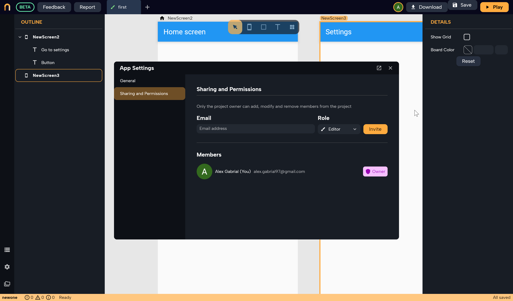

# Inviting other members to your project


*On this page, you will learn:*
```
1. How to share your project with other members
2. How to grant specific permission to each user
Collaboration is key to building amazing apps, and Nowa makes it easy to share your projects with team members while granting specific permissions for each one. Let's see how it's done:
```
## Overview

With Nowa, you can easily share your project with your team members, giving each one specific permission. When inviting team members, you have three options for the permissions:

1.  **Owner**: They are the owner of the project and have full access to every feature and setting.
    
2.  **Editor**: They can build and edit any part of the project, such as editing designs, adding logic, and adding data sources. However, they do not have access to sensitive parts, such as some app settings like the project name. They cannot delete projects or invite or remove other members from the project.
    
3.  **View only**: They can view the entire project without being able to make any edits. They also do not have access to app settings.
    

## Adding Members to Your Project

To add members to your project, follow these steps:

1.  Go to your **project settings** (located at the bottom-left corner).
2.  Click on the **Sharing and Permissions** section on the left side of the popup.
3.  Enter the email address of the user you would like to share the project with.
4.  Define their role and click on **Invite**.




You will see the invited account added under "Members" with a "Pending" status until the user accepts the invitation by clicking the **Join Project** button in the email they receive.

After the user accepts the invitation, they can see the project in their dashboard.

You can later change the permission type from the same **Sharing and permission** panel.

:::caution
Currently, we do not recommend that you and other members in your project work on the same file in the project at the same time, as this might cause some issues. Instead, you can work on different files simultaneously or on the same file but at different times.

This is just temporary until we release our "Live Collaboration" feature, which will allow you all to work on the same file simultaneously while viewing each other's actions. Stay tuned for this exciting update!

:::

With Nowa's project-sharing capabilities, you can efficiently collaborate with your team, making it easier to build world-class apps. **Happy building!**