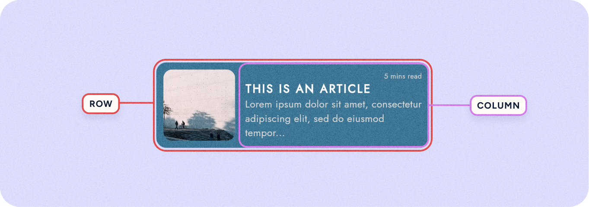

# How to make a screen responsive

In this section, we will have a look at how to make a screen responsive using columns and rows, and the layout features. 
Make sure to check the following pages to have all the information needed regarding these features:

- [Intro to Layout](../ui/layout/intro-layout.md)
- [Columns and Rows](../ui/layout/rows-and-columns.md)

### What does making a screen responsive mean?

Making a screen responsive means designing your app's pages so they automatically adjust and look good on different devices and screen sizes. This includes smartphones, tablets, and desktop computers. A responsive screen changes the layout, size, and proportions of elements to fit the screen it's being viewed on. The goal is to make sure everyone has a great experience using your app, no matter what device they're on.

### How a screen is divided into columns and rows

To achieve responsiveness, screens are often divided into columns and rows. This system is much like a grid on a spreadsheet, where each screen can be seen as a set of horizontal rows and vertical columns. This grid helps organize the content and interface elements, making it easier to adapt to different screen sizes and orientations.

When you design a screen, you place elements (like buttons, images, and text) within these columns and rows. You can decide how many columns or rows an element should span, and how they should resize as the screen changes.

By using rows and columns, you can create a flexible layout that adjusts automatically. Elements within the grid move or resize according to the screen's dimensions, ensuring that the app looks organized and works well on any device, from a large desktop monitor to a small mobile phone. This grid-based approach is a key part of making screens responsive.

To turn a screen layout into a column/row:
- Select the Screen
- In the details panel change the group orientation to [↓] Column or [→] Row.

:::tip
To learn more about these options check [Columns and Rows](../ui/layout/rows-and-columns.md).
:::

This grid approach applies not just to entire screens but also to smaller widgets, cards, and groups of widgets within those screens.

For instance, inside a card, you might have text, images, or buttons, which are also arranged using rows and columns to keep them organized and adaptable to screen changes.

By applying this grid system at both the large and small scales, every part of your app can respond to different screen sizes. This means a group of widgets inside a card will rearrange themselves just like the larger sections of the app, ensuring consistency and a fluid user experience across all device types.

### Make a widget resize with the screen

To make a screen responsive, widgets need to change size along with the screen. This adaptability ensures that the content looks good and remains usable across different devices, from small smartphones to large desktop monitors.
To achieve this you need to use the **sizing options** and **spacing options**.

The sizing options are:

- **Expand** → allows widgets to fill available space
- **Auto** → adjusts widgets to fit their content
- **Fixed** → keeps widgets at a constant size regardless of screen changes

The spacing options are:

- **Fixed** → keeps spacing constant distance between elements, regardless of screen size
- **Between** → places space between widgets but not at the beginning or end
- **Around** → provides space around each widget, including the beginning and end
- **Evenly** → distributes space so that each widget has equal spacing on all sides, creating a balanced and symmetrical layout

💡 Learn more about this options on: [Columns and Rows](../ui/layout/rows-and-columns.md)

By combining these sizing and spacing options, you can create a responsive widget layout

By combining sizing options with spacing options you can craft a responsive layout that looks good on any device. Their combination results in a cohesive and accessible design that adapts well to varying screen sizes.

### Example: Make a design responsive

Let's have a look at how we can make a card responsive and insert it in a screen that is responsive as well.

**Step 1**: After designing your card, distribute its widgets in columns and rows depending if they are organized in a horizontal or vertical ax.
- Select all widgets in the card, and group them with `ctrl/cmd+G`
- Decide the orientation (column or row) from the details panel.

**Step 2**: Depending on how you want the card to behave, sizing options of the columns and rows that you just created.
- Select the column/row you want to modify
- From the layout option select expand, fixed or auto for the height and width of the column.

