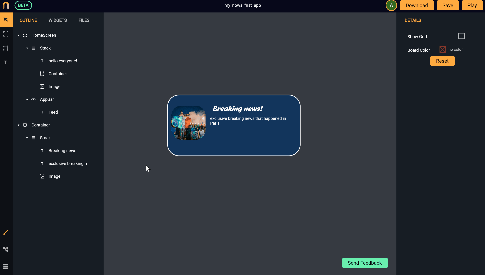
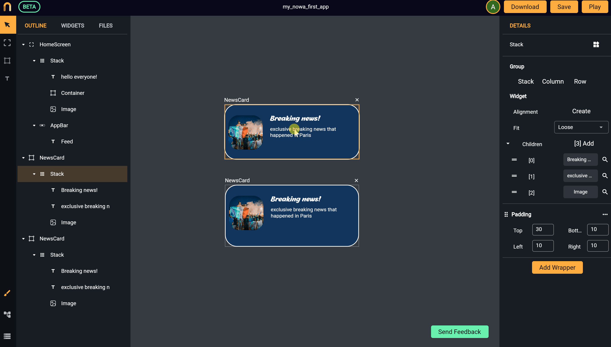

# Components
*In this section, you will learn:*
```
1. What are components and how to create them
2. Why components are useful
3. How to create multiple copies of a widget that will be automatically modified if any copy was modified
```
### What are components and why using them


`Components` are simply widgets that are made to have multiple copies in different places. What makes components special compared to normal widgets is that modifying any copy of the component will update all the other copies in the entire app.

It is used when you want to have multiple copies of a widget but you want them all to look the same. In other words, if you changed anything in any copy of that component, you want the rest of the copies to be automatically updated. 

For example, if you created a card widget that will hold one piece of news, this card widget will have multiple copies each one holding one piece of news. You might also use the same card inside another screen. Let’s say you decided to change the font of the text inside the card, you don’t want to look everywhere you used that card and change the text font manually. On the other hand, if you created a component out of that widget that holds the news card, updating anything in any copy will update the rest of the copies of that card automatically in the entire app.


### How to create a component and modify it

To create a component, select the widget you want to change to a component, then click on the small icon beside the widget name on the top right of the `details panel`, or right-click from the `outline panel` then choose `Create component`. *See the following example of creating a component out of a widget and renaming the component to “NewsCard”:*

 

You can find your components by going to the `Assets panel` and then clicking on `Library`. From there you can drag and drop a copy of any component on the board to create a copy.

Changing anything in any copy of the component will change all the copies everywhere. *The following example shows two copies of the same “NewsCard” component mentioned earlier. Notice how changing the layout or the color of the text will automatically be applied to the other copy:*

 

>Note: to modify any widget inside the component, **the component should be outside any screen** to be able to access its widgets. This is done to prevent any modification that might happen by mistake for any copy of the component when it is inside a screen

>We will be happy to listen to your suggestions for a feature or an improvement. Please contact us at `info@nowa.dev` or use our [discord server](https://discord.com/invite/ByKfn3H7gX) or [Instagram page](https://instagram.com/nowa.dev).

