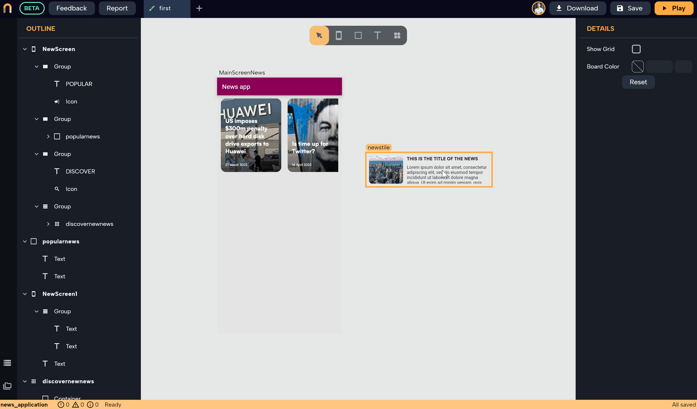
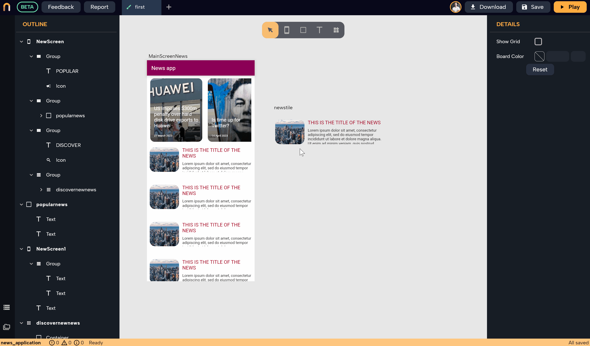
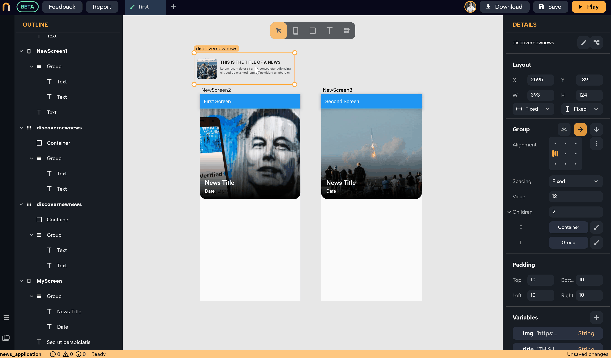

# Components

*In this section you will learn:*
```
1. What are components and when to use them
2. Creating components and modifying them
3. Dtaching instances from a component 
4. Deleting components
5. 
```

Components are a powerful concept that makes you much more efficient in the design process. It allows you to create reusable widgets and have them connected. These components can be easily modified and maintained throughout your app to ensure a consistent design. Let's dive into more details then:

## What is a Component?

**A Component is simply a widget or a group of widgets that will be reused in multiple places within your app**.

 Instead of duplicating widgets that you need to use in multiple places and then manually modifying each instance if you decided to do a modification, you can create a Component out of that widget and use multiple instances of that component across the app. 
 
 Any changes made to a single instance will affect all other instances of that Component in the entire app without you having to worry. To understand better, let's see the following example:

### Example

Imagine you have a recipe app with a screen displaying cards that hold information about available recipes. 

When a user clicks on a card, another screen opens with full details. If you use this card on multiple screens or have multiple cards in a list on the same screen, you should create the card as a Component.

 This way, if you decided to change something on the design later (e.g., adding a text widget to show when the recipe was added), the change will be reflected in all instances of the card in the entire app.

---

## Creating a Component

1.  Select the widget or group of widgets that you want to create a Component out of.
2.  Click on the "Create component" icon in the top right corner.
3.  Enter a name for the Component.
4.  Click "Create".


:::info
The name of each component should be unique, so choose a different name or delete the old component with the name you want to use
:::


### Creating multiple instances of a single component
By copy-pasting (select the component > right-click > copy, then right-click somewhere on the board > paste, or by selecting the component > `Ctrl+C` to copy > click somewhere on the board > `Ctrl+V`  ), or duplicating a component (hold `Alt` while dragging the component to duplicate), you can create multiple instances out of that component

#### Example 
In the following example, we want to create a group (column) out of a single component which is the `newstile` that we created earlier. To do so:
1. Create multiple instances of the component (by copying/pasting or holding `Alt`+drag the component)
2. select all the instances then create a group out of it (**click on `Ctrl+G` or right-click > Group**) 
3. Choose the vertical arrow (to make the group behave as a column where all items are placed vertically). For more, read about [Groups](./groups.md).
4. Place the group inside the screen, then choose **Expended** as the height option in the **Layout** to make the group expand and fill all the vertical space (the screen layout should be already set on **vertical** in order for the Expanded option to appear, for more information check)
5. You can manually change the number of children (just to see how the design will look like with different number of items in that list, but later the number of the items will be automatically set according to the data you have)
6. Add a **Scroll** wrapper to make the list scrollable (when the number of items can't fit in the column, the scroll wrapper should be added. More on that in [Wrappers](./wrappers.md))



:::tip

In the above example, having variables connected to the fields that will change in each instance is essential so each instance can show different pieces of news that are sent from the group itself.

 For example, connecting a variable to the image URL, title, and content so that when the group has a list of news that is distributed among the instances, each instance will display the image, title, and content for that news. 
 
 For more information go the next section about adding variables to a component, and also check the [News app real use-case](../use-cases/news_app.md) to see the full example of building a news app.

:::

### Modifying one instance of the component
In the following example, we are modifying the font, text size, and color for the title widget inside the component, and the radius of the image. Notice how all the instances are getting updated with every change made in the component.


:::caution
You can't edit the design of a component while it's inside a screen. You can only modify it when an instance of that component is outside any screen (just on the board). 

Thefore leave one instance of each component on the board for you to do any modifications, or simply drag and drop an instance of it on the board from `Files`. 

The reason for this is to protect you from accidentally modifying a component within a screen and forgetting that it's component and hence making unintended changes in other component instances somewhere else 
:::

---

## Using Variables with Components

To make each instance of the same component holds different data according to its location, you should connect the components properties with variables.

After creating variables for the component, each instance of that component can have its own data that get passed from the parent screen/component through the variables, allowing for different data to be presented in each instance of the samecomponent while maintaining the same design and layout.

 In the following example, we created a component for holding a single piece of news with an image, a title, and content. We are connecting variables to the following three properties: **Image URL** for the container widget, and the **Text** properties for the Title and Content widgets. 

 

 After connecting those three properties with variables, we can pass different data to each instance. To see an example of how that case will be useful when passing data, check out [Groups](./groups.md). 

 
  To read more about how to add variables to a component or a screen, check [Variables](../logic/variables.md).


### Example

For a news tile component, after creating the design which consist of three widgets (`Container` with an image for holing the image of the news, and two `Text` widgets, one for the title and one for part of the content), create variables for three properties, one that is connected to the `Image Url` field to hold the image URL, and another two for holding the text for the title and content text widgets. This will allow us to pass different image urls, titles and content strings to each instance of that news tile component.

When placing two copies of the component inside different screens (or inside other components as well), set the value of the variables for each instance alone. You can also connect each instance's variables to the variables in its parent screen, so instances of the same component in different screens will show different data according to the data passed to it from their parent screens or widgets. See the following example:



---

## Detaching Instances from Components

If you want to disconnect an instance from its original component, **select the instance > right-click> click "Detach"**. 

This will make the instance independent from its component, and any changes made to the Component will no longer affect the detached instance and vice versa. 

:::caution
Note that after detaching you might have to modify the variables if the component originally had variables that are connected to some widget properties before detaching because those properties won't be able to access the variables that were attached to the component. 

In this case, you can create new variables or just remove the variables from the properties.
:::caution

---

## Deleting Components

Deleting a component from the board doesn't completely remove it from the app; it can still be accessed from the files. To permanently delete a Component, you must delete it from the **Files**.


