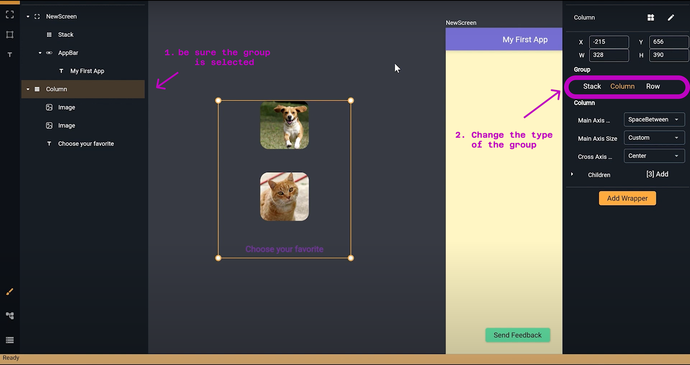
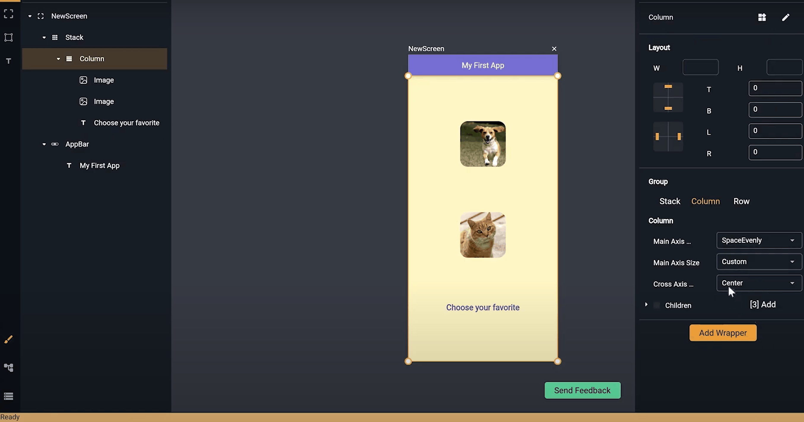
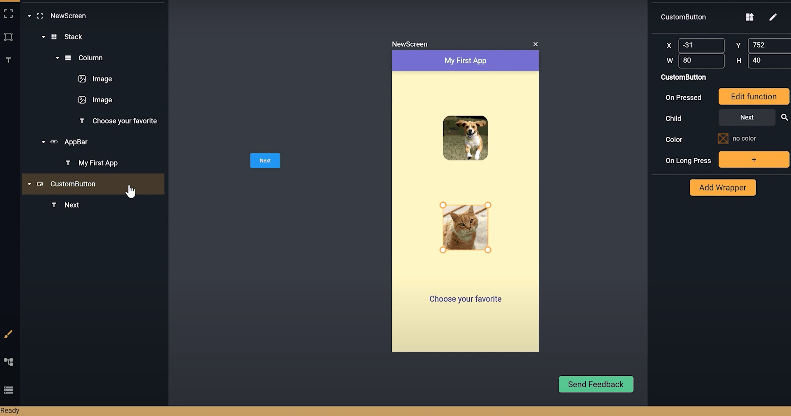

# Grouping
*In this section, you will learn:*
```
1. What is grouping in Nowa?
2. how to create a group (Stack, Column, Raw) 
3. How to change the axis alighment.  
```
You can also watch the following tutorial on youtube: [Discover GROUPS in NOWA](https://www.youtube.com/watch?v=g9JobVIPRlM).

---

### What are groups? 

>It is simply a group of widgets that are arranged in a specific way. Groups are a simple way in Nowa to create a stack, a column, or a raw.

When the group is of type `Column`, it means all the wigets will be stacked vertically. If the group is a `Raw` means widgets will be stacked horizontally , and if it is a `Stack`, it makes all widgets inside have a free position.

To create a group, select all the widgets that you want to group together, then right-click and choose `Group` or simply click `Ctrl + G`. See the following example (notice how the widgets in the outline goes under a group widget, which is `Stack` in this case):

 

By default, the group will be of type `Stack`. You can change it afterward to a `Column` or a `Raw` using the details panel. 



If the group type is a `Column` or a `Raw`, you can define the `Main Axis Alignment` (which is the vertical for the `Column` and the horizantal for the `Raw`) and the `Cross Axis Alignment`(which is the other axis). See the following example of changing the `Main Axis Alignment` for a `Column`:

 

Here the `Cross Axis Alignment` is being changed: 

 


### Why using groups?

Grouping make your UI building much easier. For example if you added a widget later to a group with alignment settings, the widget will be auotmatcally positioned and aligned according to the group. See the following example of adding a widget to an already established Column group.

 

You can reorder the widgets inside the group easily by drag and drop from the board or using the `outline panel`. 

 
