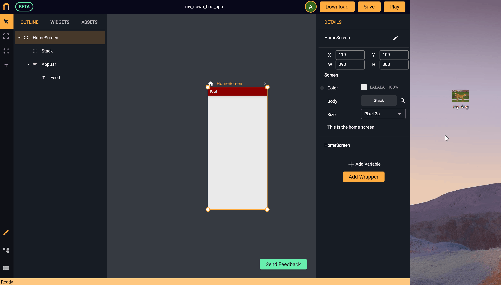
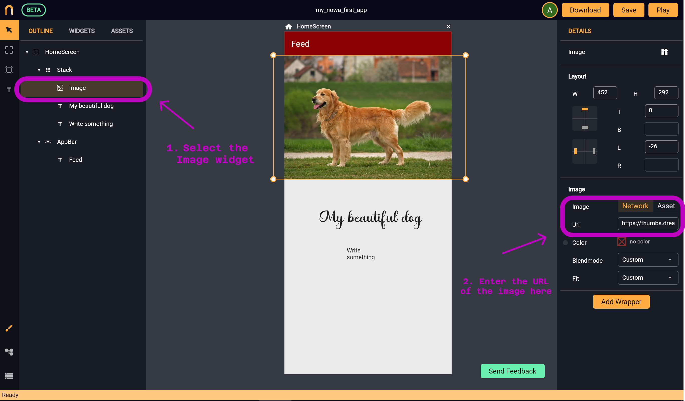
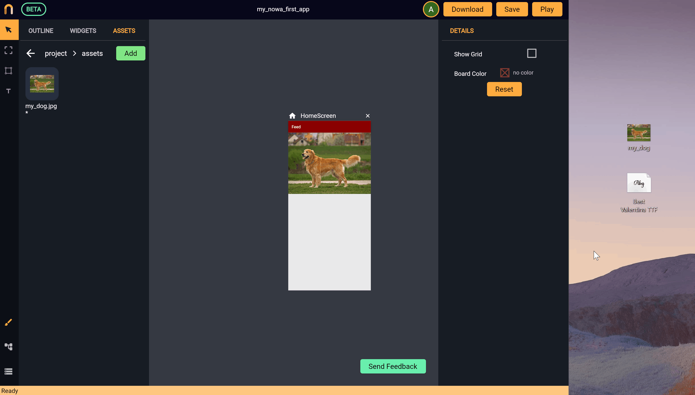
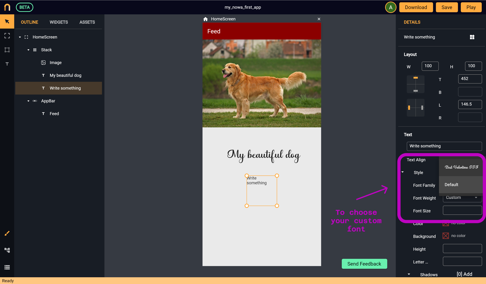
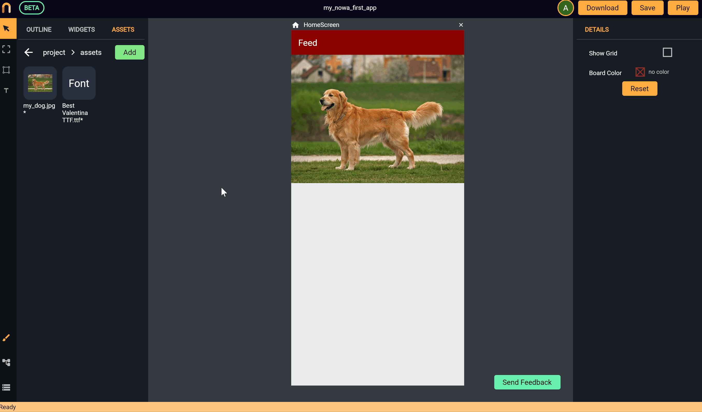

# Import Assets (Images, Fonts, etc)

*In this section, you will learn*:
```
1. How to import local or online images
2. How to import and use custom fonts
```
Adding assets to your project is super simple with Nowa! Just drag and drop your asset files inside the project. They will be added automatically to your `assets` folder in your project. You can access your project files from the `Assets` panel. Let’s see together how can you add images or custom fonts to your project.

## Adding Images

Images can be stored on your device, or they can be available on the internet. Let’s see how to add them in each case.

* In case of the image is being stored on your device, just drag and drop the image into your project. It will be added on the board and will be added inside your assets folder. To reuse the same image again, just drag and drop it from your assets folder, or simply use the `Image` widget, then connect the widget with the image by going to the `details panel` and choosing `Assets` to indicate the source of the image, then click on `Pick Image` to choose the image from your assets folder. See the following image:

 

* In case the image is stored online, just drag and drop the `Image` widget, choose `Network` from the details panel and paste the link in the `Url` field.



## Adding custom fonts

*We know how important is it to have a nice-looking font in your app, therefore we made it super simple for you to use custom fonts.*

To do so, just drag and drop a custom font file inside the project. The font will be added inside the `assets` folder. See the following example:

 

To use the custom font you added: drag and drop a `Text` widget, then choose your font from the `Font Family` field inside the `details panel`.



Or simply drag and drop the font file from your `assets` folder. See the following example:

 


