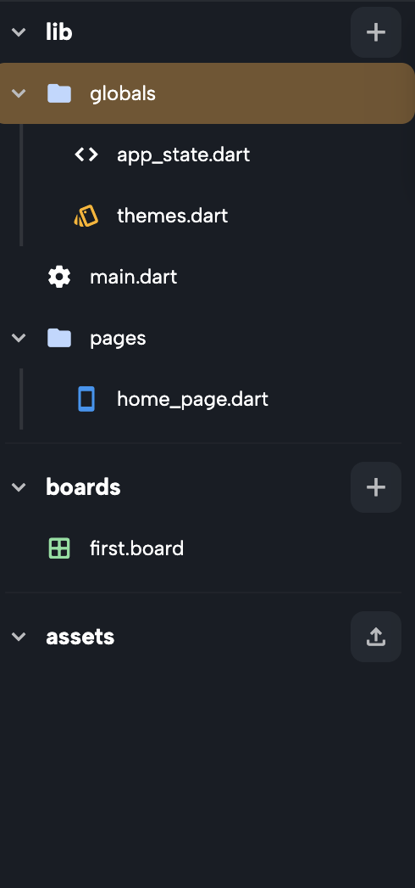

Themes in Nowa allow you to customize and manage the appearance of your app, including colors, typography, and styles. This section provides an overview of how to create themes and use them effectively in your projects.

---

## **Introduction to Themes**

### **Default Themes**
- When you create a project in Nowa, it includes a `themes.dart` file located in the `globals` folder. This file contains the default themes (Light and Dark) and all the theme settings for your project.

:::note
- If your project was created before the introduction of themes, you can enable the theme setup:
  1. Select any Text widget.
  2. Click on **Style** > **Connect**.
  3. Follow the prompt to create the theme setup by clicking **Create**.

  

:::

### **Managing Themes**
- To set a default theme:
  - Open the `themes.dart` file in the `globals` folder.
  - Hover over a theme and select **Set as default**.

- To create a new theme:
  - Click on **Create New Theme** within the `themes.dart` file.
  - You can rename or delete a theme by right-clicking on it.

---

## **Customizing Themes**

Themes in Nowa allow you to define properties like colors, typography, and styles. Each theme can be customized to suit your application's design needs.

- Inside each theme, you’ll find adjustable properties, including:
  - **Colors**: Define the palette for your app, including primary, secondary, and background colors.
  - **Typography**: Configure text styles such as headings, body text, and labels.

---

## **Dynamic Theme Changes**
Nowa supports dynamic theme switching during runtime, allowing you to provide a tailored experience for users. 

- To change the theme dynamically:
  1. Use the **changeTheme** function provided in the `AppState` global state.
  2. For example, to switch to Dark mode when a button is pressed:
     - Add a button widget.
     - In its `onPressed` property, add the **App State** node from **Globals**.
     - Click on `+` next to `AppState.of()`to access what's inside, and select the function **changeTheme**. Choose the desired theme (e.g., "Dark Theme").
     - Test your app to see the theme change in action.
     
     

---

With themes, you can create a consistent design system, dynamically switch styles, and ensure your app looks professional across all screens. In the next sections, we’ll explore [Colors](./colors_themes.md) and [Typography](./typograhies.md) in detail.

