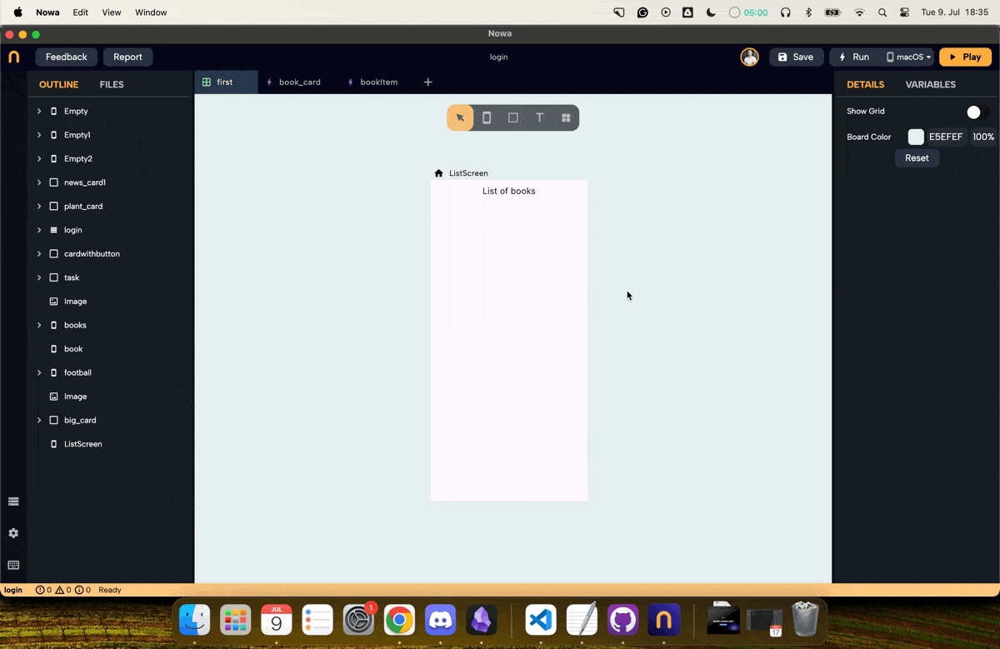
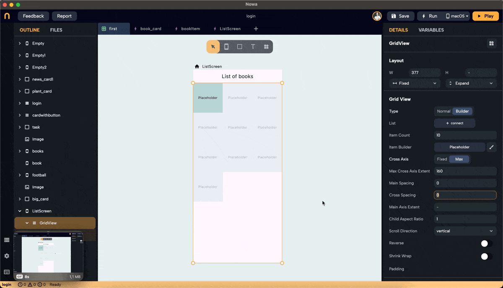
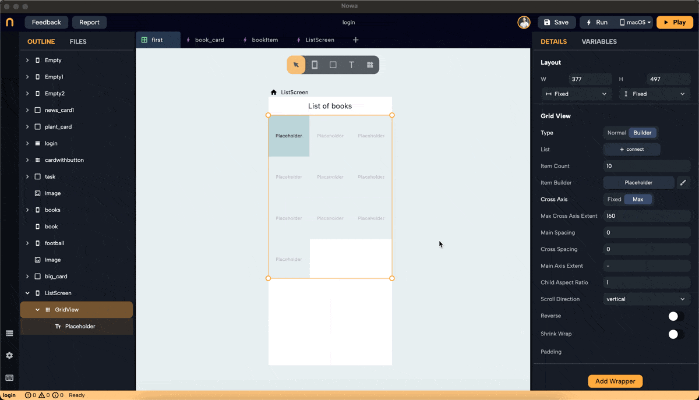
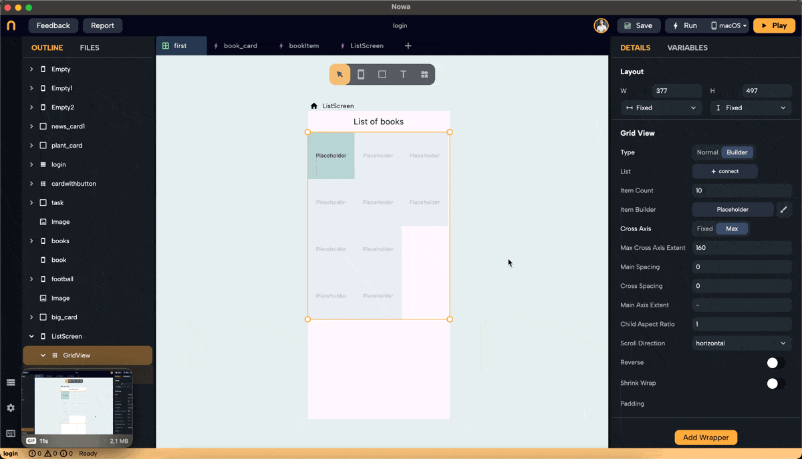
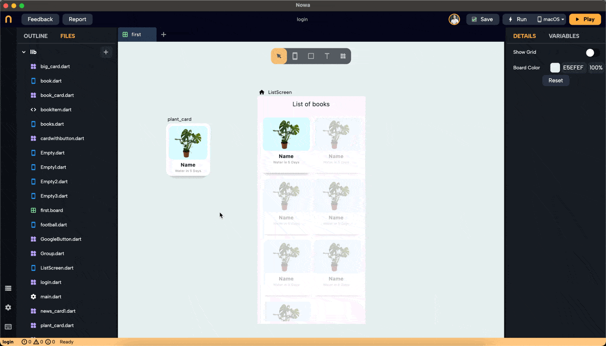
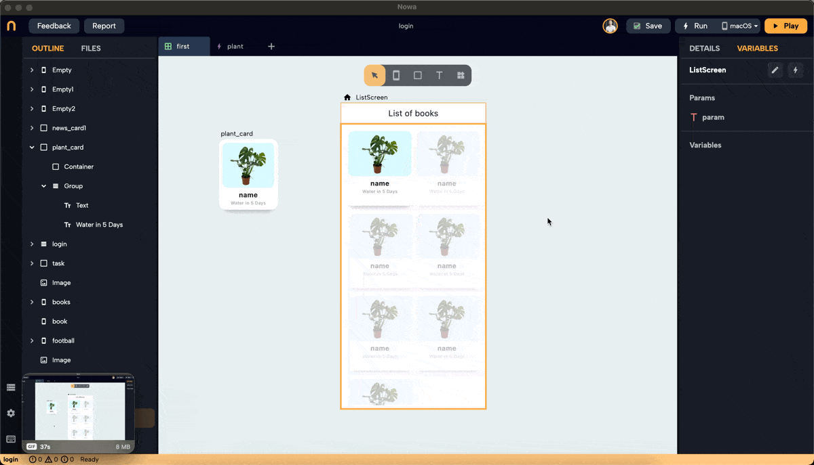

# GridView

## Introduction

The two main ways to show data in your app in Nowa are through the [ListView](./listview.md) and GridView widgets. This document explains how to use the GridView widget. 

Similar to ListView, there are two modes for GridView: Builder mode and Normal mode.

- **Builder Mode**: Used when you want to connect the GridView to a variable or parameter of a type list. This list can be a local list variable on the screen, a global list in the global state, or a list received from an API response, Firebase, Supabase, etc.

- **Normal Mode**: Used to display a group of widgets in a GridView without connecting to a data source.

## Adding and Configuring GridView

### Step 1: Drop a GridView Widget

- Drop a GridView widget onto the screen.
- To make it fill the horizontal and vertical space, set the screen layout to a column. Then, after dropping the GridView, you will find an extra option in the layout for width and height called "Extend," which allows you to extend it horizontally and vertically.
- By default, the GridView will be in Builder mode.
- In Builder mode, you can set the full layout: choose a placeholder, set all spacing and properties, and connect the GridView to a variable list at the end once you are satisfied with the layout.
- Modify the `itemCount` to preview how the GridView will look with different numbers of items. The count will eventually be determined by the length of the list you connect to.

### Step 2: Add a Placeholder

- By default, the GridView has a placeholder. Click on "Placeholder" next to the `itemBuilder` property in the details panel to replace it with a widget of your choice. In this example, we created a component called "plant_card" to use as the placeholder.

### Step 3: Set Cross Axis Configuration

- Configure the cross-axis. Choose between "Fixed" and "Max."
- **Fixed**: Specify how many items will be in the cross-axis alignment. For example, setting it to 3 will resize the widgets to fit three items in the cross-axis.

- **Max**: Define the maximum size for each widget, ensuring no widget exceeds the specified dimensions. In this example, we set the max to 160 pixels, meaning the width of each widget won't exceed 160 pixels.

### Step 4: Adjust Main Axis and Cross Axis Spacing

- **Main Axis Spacing**: Adds space between items along the main axis. For vertical scroll, the main axis is horizontal.

- **Cross Axis Spacing**: Adds space between items along the cross-axis. For vertical scroll, the cross-axis is horizontal.

### Step 5: Set Main Axis Extent and Aspect Ratio

- **Main Axis Extent**: Sets a fixed length for items along the main axis (height for vertical scroll). This property sets the height (vertical grid) or width (horizontal grid) for each grid item.

- **Aspect Ratio**: Maintains a fixed ratio between width and height for each item. Ensure the main axis extent is set to null to use the aspect ratio (right-click on main axis extent and choose "set to Null" or "Set to default").

### Step 6: Normal Mode Configuration

- In Normal mode, set the number of children needed by entering a number or clicking the "+" button to add one.
- Replace each placeholder created with the desired widget.
- Note: Clicking on the children property to connect it to a list will switch the GridView to Builder mode.

## Real Example: Using GridView to Display Plant Cards

### Step 1: Create an Object for Plant Information

- We created a GridView in Builder mode, set the layout, and chose "card_plant" as the placeholder. To display plant names and images, create an object to hold this information.
- In files, click "+" then "new object," name it "plant," and set `name` and `imageURL` as String parameters. Set default values for `name` and `imageURL`.

### Step 2: Create a Parameter and List for Plant Items

- Create a parameter inside the card called "plantItem" of type "plant." It will have the default values for `name` and `imageURL`. 

- Connect `name` and `imageURL` to the `text` property in Text widget that will hold the title of the plant, and `imageURL` to the `Url` property in the `Image` widget

- Create a list variable of type `plant` inside the screen, and call it "plants". Add 7 items to the list. The items added to the list will have the default values. Change them to add the actual info about the plants you want to display.

:::note
This list will typically be received from a data source like an API or Firebase. Here, we manually add items to demonstrate the process.
:::

### Step 3: Connect the List to GridView

- After creating the list "plants" and filling it with plant objects, click "connect" next to the "List" property for the GridView and choose the "plants" list from "Locals."
- The GridView will display the same number of items as the number of plants in the list.

### Step 4: Pass the Element to Placeholder

- To Pass each item from the "plants" list to the "plantItem" parameter of each item in the GridView. Select the placeholder widget "card_plant" under the GridView (you can do it ), click on the "plantItem" parameter, and connect it to "element".

- The "plant_card" component will then use the `name` and `imageURL` values from the parameter to display them in the Text widget and ImageURL.
