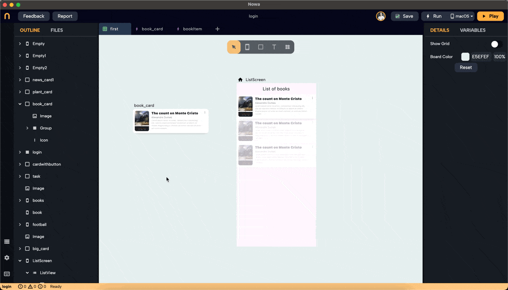
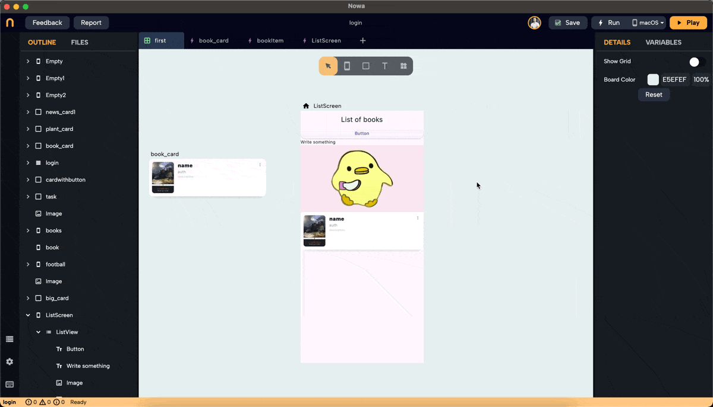

Most of the apps need lists to display data. In this page you will learn how to use the new version of the Listview widget to display a group of widgets, or display a list of data.

The ListView widget in Nowa allows you to create scrollable lists efficiently. It comes in two modes: "Builder" and "Normal." This guide will walk you through the steps to use both modes effectively.

### 1. Adding a ListView Widget

- **To drop a ListView widget**, open the widget picker or press `Ctrl/Cmd + O`.
- **Modes**:
  - **Builder Mode**: Connects to a list variable or parameter. It uses a single placeholder widget to display data from the list. This mode renders only the necessary items for the available screen space, improving performance for large lists. It includes an option to add separators between items.
  - **Normal Mode**: Use this to display different widgets in a list. Unlike Builder mode, it accepts multiple widget types and acts as a scrollable column.

#### Example: Dropping a ListView in Builder Mode

- **Optional setup**In case you want the Listview widget to take the entire height or width: Set the main layout of the screen to a column. Use the "Expand" option inside the layout options for the ListView to make it expand in width, height or both, making it also responsive to different screen sizes.

- **Customization**: After dropping the ListView, it will come by default on "Builder" mode. You can customize the UI by selecting the placeholder widget, separator, padding, etc and then connect it to an actual list in the end.

### 2. Setting a Placeholder Widget

- **Select Placeholder**: Click on "Placeholder" next to "itemBuilder" to choose the widget that will act as the placeholder for the Listview. You can select a normal widget, like the `Text` widget, or a component you created before the combines multiple widgets (Read more here on [components](../../../ui/components.md)).

In this example, we selected the `book_card` component that was created previously. 

### 3. Adjusting Item Count

- **Item Count**: Change the `itemCount` to see how the list looks with different sizes. The itemCount will automatically match the length of the connected list when connecting it, but for now, you can modify it during the design process just to preview it. 

### 4. Adding Separators

- **Fixed Spacing**: Change the separator from "None" to "Fixed spacing" to add fixed spaces between items. Adjust the spacing using the "spacing" field or by dragging the space in the ListView.

- **Widget Separator**: Choose "widget" to add a specific widget as a separator. For example, add a "divider" widget and adjust its properties such as height, thickness, and color.

### 5. Connecting the List

- **Connect to List**: Click on "connect +" in the details panel and select the list to display. In this example, we want to display books in a listview. To do so, follow the following steps:  
  - Create an object called `bookItem` with the following String parameters: name, description, author, and imageURL.
  - Create a parameter for the `book_card` component of the type of the object we created before `bookItem` to inject an instance of `bookItem` into the component.
  - Connect the component's parameters to its properties (e.g., imageURL to the image widget).
  - Create a variable list of `bookItem` object called `listOfBooks`. It will contain a group of `bookItem` objects, each will hold info about a specific book. You can fill the list by typing the book infomation for each item in the list.
  - After dropping the ListView, select the `book_card` component as the placeholder widget for the Listview.
  - Click "connect +" for the ListView in the details panel, and choose `listOfBooks` (the list variable we created before for the screen.)
  - Select the placeholder widget of the Listview, and connect it's parameter that we created before, to the `element` variable passed from the list to each placeholder instance. You will find `element`under `Locals`.

  

  :::note

  Listview widget automatically creates a variable called `element` when it gets connected to a list.

   This `element` variable is the single item from the list that the Listview is passing to each instance of its Placeholder.

   The `element` can be found inside `Locals` category for any widget that goes under the Listview 
  :::

### 6. Adding Padding

- **Padding**: Add padding to the ListView around the list. Specify values for the top, bottom, right, and left padding.

### 7. Using the Normal ListView

- **Switch to Normal Mode**: Drop a ListView, expand its width and height, and click "normal" to switch modes.
- **Adding Widgets**: Under the "children" property in the details panel, click `+` to add widgets. Replace placeholders with desired widgets, reorder them by drag and drop, or replace them from the details panel on the right, or from the outline on the left.

### 8. Switching Back to Builder Mode

:::warning
When switching from normal to builder mode, **only the first child widget will remain.** The rest will be removed because the builder mode uses a single placeholder for all items. See the example below.
:::

:::tip
**Reorder Widgets**: If you want another widget to be the placeholder, reorder the list so the desired widget is first, then switch to builder mode.
:::

By following these steps, you can efficiently use the ListView widget in Nowa to create professional and responsive lists for your apps. 

