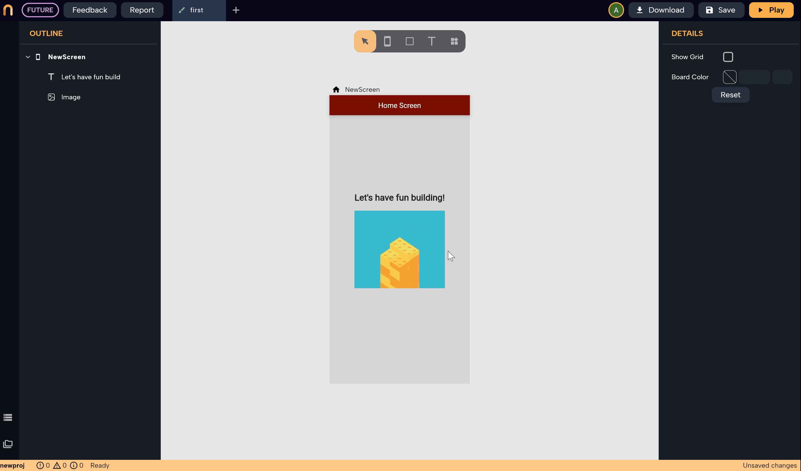

# Wrappers
*In this section you will learn:*
```
1. What are wrappers and how to add them to your widgets
2. Why use wrappers
3. How to add (padding, rotation, scrolling, opacity, etc.) to your widgets
4. How to make any widget interact with user clicks
5. How to control the alignment of a widget corresponding to its parent widget

```
### What are Wrappers?

Wrappers are a new concept for you, but it's very simple, they are just Flutter widgets that have a single child only. 

Those widgets were separated from the rest because they are usually used as parents of other widgets, their main purpose is to pass some UI or functionality properties to their child. They also don't appear on the `Outline` to make it much more clean and easy to read and edit.

For example, `Container`, `Padding`, `Clip Radius`, and `Transform` are wrappers that add UI effects on their child widget. On the other hand, `Gesture Detector`*(used to add a response for taps and clicks)*, `Data Builder`*(used to make their child widget access a data source like Firebase or Rest API)* add functionalities to their child widgets.

To add a `Wrapper`, select the widget that you want to wrap it (base widget), then in the `Details panel` click on `Add Wrapper` then choose the wrapper you want. After that, you can customize the wrapper by modifying the wrapper properties in the `details panel`.

You can add multiple wrappers as well and you can drag and drop them above each other to reorder them.

:::tip
The order of the wrappers matters: the order of the wrappers in the details panel follows a **bottom-up style** meaning that the wrapper that comes below in the details panel comes above in the widget tree. That's why the base widget will come above all wrappers in the details panel, but it comes at the bottom of the Flutter widget tree. 
:::

### Example

To understand better, let's talk a look at the following example. The `Image` widget was wrapped first with `Clip Radius`, so the borders of the image became rounded after that. Then a `Transform` widget was added on top to rotate the rounded image. Notice when the order changed and the `Clip Radius`becamse below the `Transform` wrapper in the details panel, the image was rotated first and then clipped. That's because `Clip Radius` is now wrapping `Transform` which wraps the `Image` widget *(in the details panel they are ordered bottom-up, the last wrapper is the widget that is above the rest in the widget tree)*. 





