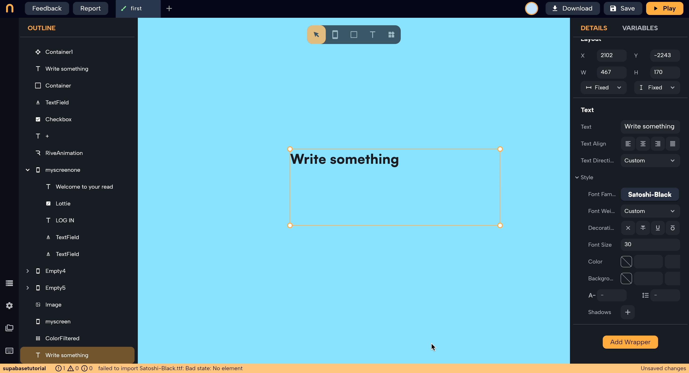

# Text Direction

The "Text Direction" wrapper is a simple yet powerful tool that sets the direction in which your text is shown. It's designed to make sure your app can support languages that read from left to right (like English) and those that read from right to left (like Arabic).

Add the wrapper to a [[Text]] Widget, from the Details panel of the wrapper you can select:

- **Left to Right (LTR):** Use this setting for languages that are read from the left side of the page to the right. It's the default direction for most languages.
- **Right to Left (RTL):** Choose this for languages that are read from the right side to the left. This is crucial for languages like Arabic and Hebrew to make sure the text appears correctly.

Simply select the appropriate text direction for your text content, and the widget ensures your app looks right and is accessible to users worldwide, regardless of the language they read in.

