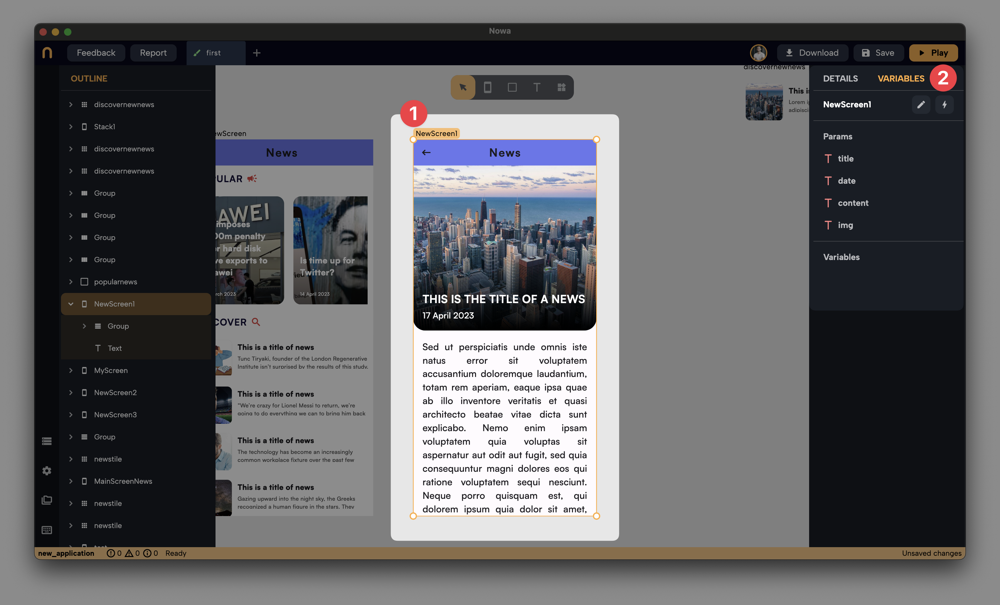

ihdijei

# Using Parameters in Nowa

In Nowa, parameters are a powerful feature that allows data to flow from one part of your app to another, enabling screens or components to display dynamic content. This guide will walk you through the process of using parameters effectively within your applications, illustrated with practical examples.

## Understanding Parameters

Parameters serve as data injectors that enable screens or components to receive external data at the moment of rendering. This functionality allows for the display of varied content on the same screen or component, depending on the data passed at runtime.

### Creating Parameters

To create parameters:
1. Select the target screen or component.
2. Navigate to the "Variables" tab on the right panel.
3. Click on the "+" next to "Params" to add new parameters.
4. For a news app, create parameters like `title`, `content`, `image url`, and `date`, all with the type `String`.

(Refer to the [Variables vs Parameters](./var_vs_param.md) page for detailed instructions on creating parameters.)

### Connecting Parameters to UI

After creating parameters, the next step is to connect each to its corresponding UI property:
- Connect the `title` parameter to the text property of a Text widget.
- Link the `content` parameter similarly for the content display.
- For the `image url`, connect it to the URL property within the image section of a "Container" widget.
- The `date` parameter can be connected to another Text widget displaying the news date.

## Navigating with Parameters

When navigating to a screen with parameters, you can pass data using the `Navigate` node in Circuit. 

Here, you can pass the `title`, `content`, `image url`, and `date` by typing in the data inside or connecting existing variables or parameters from that screen where the logic is being added to (For example, this can be the `On Tap` event logic for the card component in the main screen, where all news are displayed in cards).

Watch this [tutorial about creating a news app on Nowa](https://www.youtube.com/watch?v=aKn0wYZ3UFE&t=601s) to see how it's done in more details ;) 

## Using Parameters in Components

Parameters are also invaluable in components, allowing for reusable UI elements with dynamic data.

### Example: Shopping Item Card Component

Consider a component designed as a shopping item card with `name`, `price`, and `image url` parameters.

- **Creating Parameters**: Similar to screens, create parameters within the component for `image`, `name`, and `price`.
- **Connecting Parameters**: Link each parameter to its respective UI property. For instance, connect the `image` parameter to the image widget's URL property, `name` to a Text widget, and `price` to another Text widget displaying the item's price.
- **Displaying Multiple Instances**: On the home screen, you can display multiple instances of the ShoppingItem component, each showing different item details by passing unique values to each instance's parameters.

Look at the following video, where we created a component called `ShopItem` with it's three parameters (name, image url and price), then in the main screen, we passed different values for each card instance, allowing us to display different items using the same card component.

:::note

## Real-world scenario

In practice, the values for these parameters would come from a data source like an API or Firebase. By fetching data and passing it to each component instance, your app can display a diverse array of items, each with unique details, without redesigning the component for each item.
:::

## Conclusion

Parameters in Nowa enable the creation of dynamic, data-driven applications. By understanding how to create, connect, and pass data through parameters, developers can build versatile and responsive apps that adapt to display content based on the data received at runtime. Whether it's a detailed news article or a shopping item card, parameters make it easy to reuse screens and components efficiently while presenting diverse content to users.