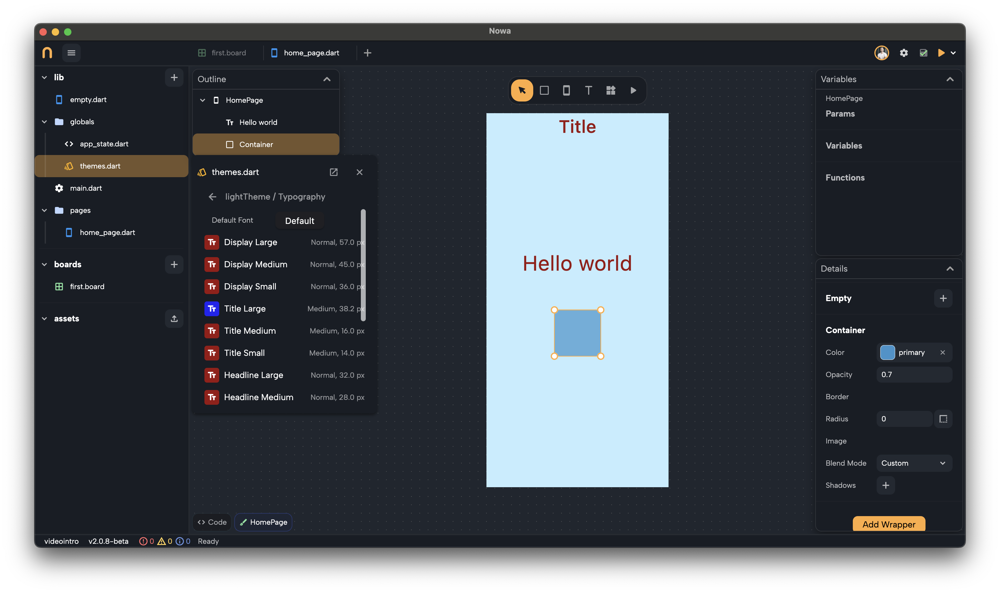
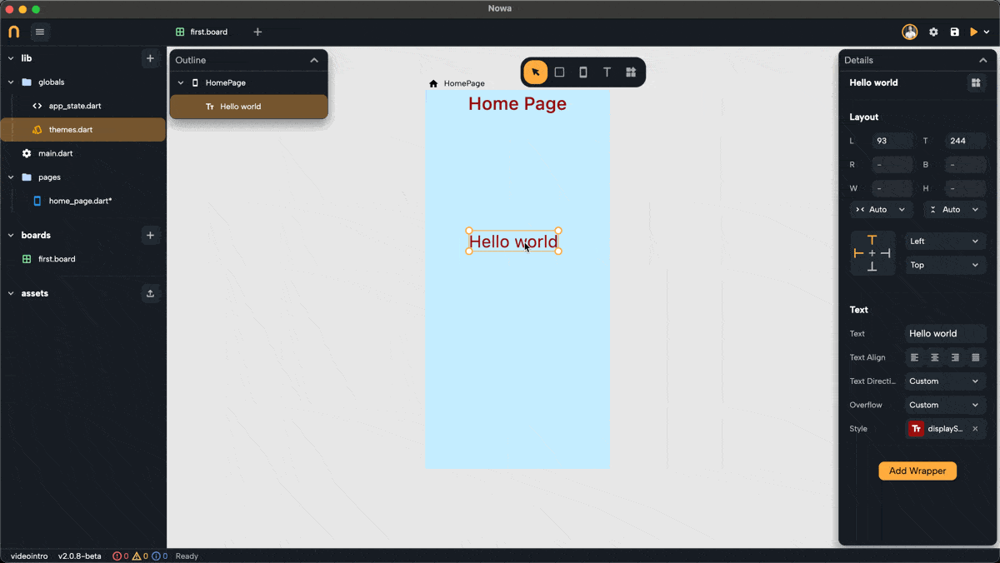
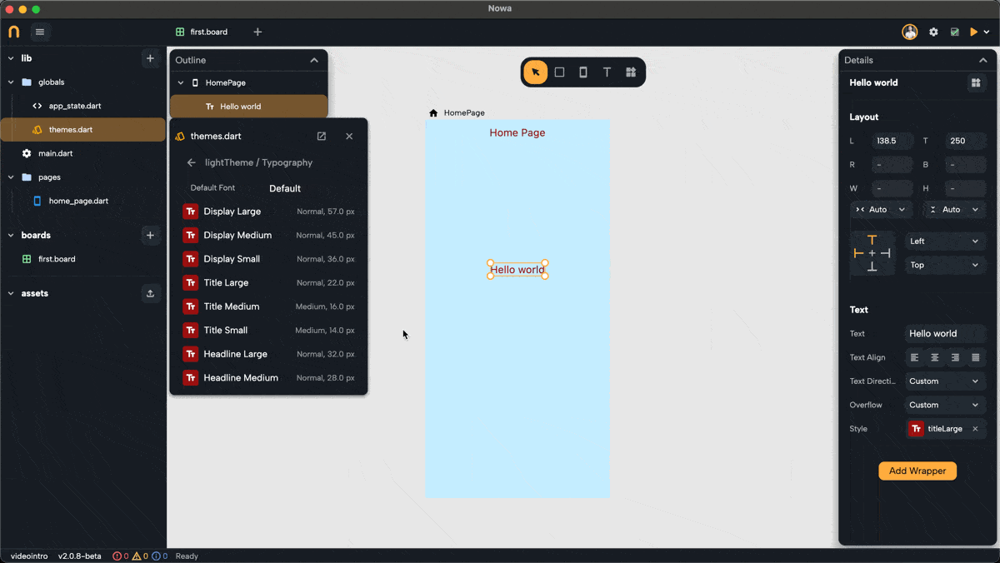

Typography in Nowa themes allows you to define and manage text styles for your app.

With pre-defined text styles, you can create a consistent and polished look for all textual elements, ensuring they adapt dynamically to theme changes.

---

## **Default Typography Styles**

To access the Typography for each theme, click on `themes.dart` inside `Globals` > `Typography`.

Each theme includes a set of pre-configured typography styles. These styles cover a wide range of use cases, from headings to body text. For example: you have `Display Large`, `Title Medium`, `Headline Small`, `Body Small`, `Label Large`, etc

These styles ensure your text is well-structured and easy to read, providing a consistent visual hierarchy.

---

## **Connecting Text to Typography**

Each text widget in Nowa is linked to a typography style. This connection ensures that your app's text dynamically adapts to theme changes. To link or change a text style:

1. Select a text widget.
2. Click on the **Style** property in the widget’s panel.
3. Choose a typography style from the available list.

When the theme or typography details are updated, all text linked to that style will automatically reflect the changes.

---

## **Editing Typography Styles**

If you need to adjust a typography style:

1. Open the `themes.dart` file in the `globals` folder.
2. Navigate to the desired theme.
3. Select **Typography** and edit the style directly.

Changes to a typography style will affect all text widgets linked to that style, ensuring consistency across your app.

If you change the typography of the default theme, you will see the changes instantly reflected in your app's text.

You can also directly modify the typography for the selected default theme by selecting the `Text` widget > `Style` > then clicking on `Edit` next to the typography that you wish to modify.

---

## **Customizing Typography for Specific Text**

Sometimes, you might want to customize a text style without altering the main typography definition. You have two options:

1. **Copy with Customization**:

   When the style is already connected to a typography, click on the **Style** property and choose **Copy with** to copy that typography style while overriding specific parts.

   These changes won’t update the typography itself within the theme. The parts that weren't changed will still follow the typography from the selected theme, while the overridden parts will remain fixed.

   For example, you can add a strikethrough to an existing style without changing the original definition. Any future updates to the original typography (e.g., font size or color) will still apply to the customized text, but the strikethrough will remain.

   

2. **Detach from Typography**:

   Click on the **Style** property and choose the **Detach Style** option to create a standalone style for the selected text widget.

   This fully disconnects the text from the theme, allowing you to create a unique style for specific use cases.

   

---

Typography in Nowa gives you complete control over text styling while keeping things consistent and adaptable.

It ensures your app's text remains professional, readable, and aligned with your overall design.

Now you’re ready to create stunning and cohesive text styles for your app!
