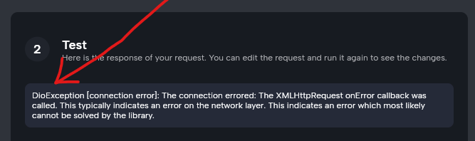

## Problem description


If you encounter a `[DioException] connection error` while firing an API request using Nowa, this may be due to browser security settings that restrict API connections. 




To work around this issue temporarily, you can disable web security settings in your browser. Here’s how to do it safely:

**Google Chrome:**
Start Chrome with security disabled to continue your work without interruption. Run the following command:

```bash
open -na "Google Chrome" --args --disable-web-security --user-data-dir="/tmp/chrome_dev"
```

**Safari:**
Safari does not directly support disabling web security via command line as Chrome does. However, for development purposes, you can disable cross-origin restrictions by enabling the 'Develop' menu via `Safari > Preferences > Advanced` and then selecting `Disable Cross-Origin Restrictions` from the `Develop` menu.

**Please Consider:**
- Use this method temporarily and solely for troubleshooting specific issues.
- Operate under a separate browser profile or user data directory to safeguard your personal data.
- Once you finish troubleshooting, make sure to revert your browser settings to maintain security.

This temporary adjustment can help you bypass certain restrictions from the browser to be able to fire API requests to test your intgerations.


