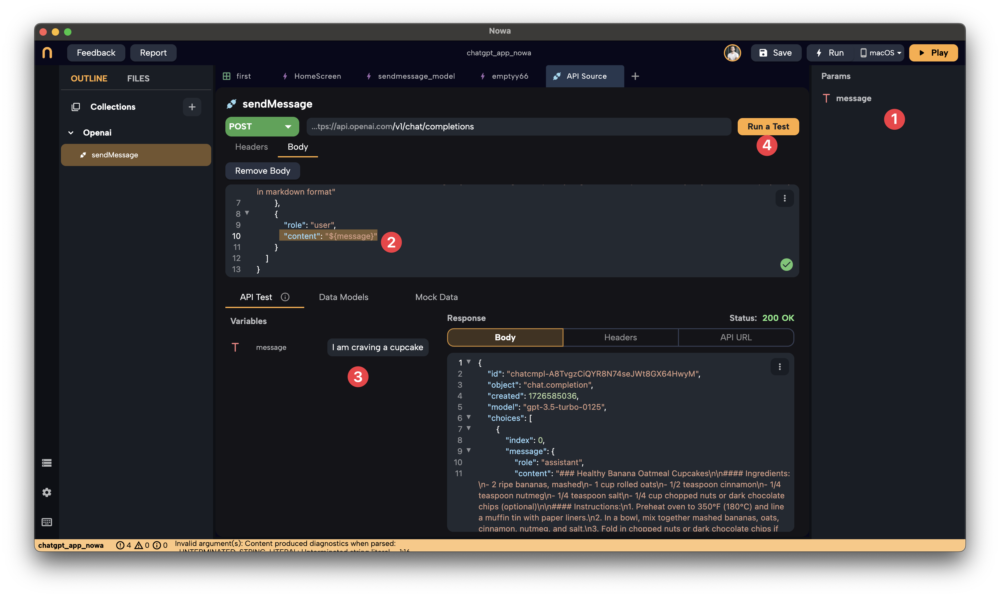

# Using Parameters in API Requests

In many cases, you'll want certain parts of your API requests to be dynamic. For example, when retrieving a specific post from a WordPress blog, the endpoint might look like `/posts/{postID}`. Similarly, when making a `POST` request, the body content may change based on user input. To handle such scenarios, you can use **parameters** in your API requests.

Parameters are variables that you define within your request. You can insert them into any part of the request—such as the endpoint, headers, or body—and their values can be provided dynamically when the app is running.

## Creating Parameters

To create a parameter in Nowa:

1. **Access the Parameters Panel:**
   - In your API request editor, look for the parameters panel on the top-right corner.
   - Click on the **`+`** button to add a new parameter.

2. **Define the Parameter:**
   - **Name:** Enter a descriptive name for the parameter (e.g., `postID`, `message`).
   - **Type:** Select the data type (e.g., `String`, `int`).
   - **Default Value:** Provide a default value that will be used if no value is provided at runtime.

3. **Insert the Parameter into the Request:**
   - In your request configuration (endpoint, headers, body), type the dollar sign `$` followed by the parameter name.
   - A dropdown will appear, allowing you to select the parameter you've just created.

   **Example:**

   - **Endpoint:** `/posts/$postID`
     - Here, `$postID` is the parameter that will be replaced with a dynamic value at runtime.


## Using Parameters in the Endpoint

Let's say you want to retrieve a specific post by its ID from a WordPress API:

1. **Create a Parameter:**
   - Name: `postID`
   - Type: `int`

2. **Modify the Endpoint:**
   - Change the endpoint to `/posts/$postID`.
   - By inserting `$postID`, you're telling Nowa to replace this placeholder with the actual post ID when the request is made.

3. **Testing the Request:**
   - In the testing section (usually at the bottom-left corner), you'll see a field for `postID`.
   - Enter different values (e.g., `9`, `10`) to test fetching posts with those IDs.
   - Click **Run Test** to see the response for each post ID.

*Example of using postID parameter in a request to fetch a single post*


## Using Parameters in the Body

Parameters can also be used in the body of `POST` requests. For instance, if you're using the ChatGPT API to create a custom assistant:

1. **Create a Parameter:**
   - Name: `message`
   - Type: `String`

2. **Modify the Body:**
   - Insert `$message` where you want the user's input to appear in the request body.
   - Example body:
     ```json
     {
       "content": "$message",
       "max_tokens": 50
     }
     ```
   - This setup allows the user's message to be dynamically included in the API request.

3. **Testing the Request:**
   - Enter a test message in the `message` field in the testing area.
   - Click **Run Test** to see how the API responds to different messages.

   *Here's how are we passing the value of message to the body though parameters for a POST request*

## Using Parameters in the App

### For GET Requests

When you use a GET request with parameters in your app:

1. **Data Builder Configuration:**
   - In the UI, add a **Data Builder** wrapper as shown in previous sections.
   - Select your API request (e.g., `getPostByID`).

2. **Provide Parameter Values:**
   - In the Data Builder's properties, you'll see an extra field for each parameter you've defined.
   - You can:
     - **Set a Specific Value:** Enter a static value for the parameter.
     - **Bind to a Variable:** Connect the parameter to a screen-level or global variable, making it dynamic based on user interaction.

3. **Example Usage:**
   watch the end of this tutorial where we used to pass a parameter of `Post ID` to the GET request through `Data builder` to fetch a single wordpress Post

   <iframe width="767" height="431" src="https://www.youtube.com/embed/_ko4iKVXVuA" title="Display WordPress Blogs in Your App Using ListView and REST API | Nowa tutorial" frameborder="0" allow="accelerometer; autoplay; clipboard-write; encrypted-media; gyroscope; picture-in-picture; web-share" referrerpolicy="strict-origin-when-cross-origin" allowfullscreen></iframe>


### For POST Requests

When handling POST requests with parameters:

1. **Using the Circuit (Logic Editor):**
   - Add the API request node to your logic flow.
   - You'll see input fields for each parameter you've defined.

2. **Provide Parameter Values:**
   - Enter values directly or bind them to variables within your logic.
   - If no value is provided, the default value you set when creating the parameter will be used.

3. **Example Usage:**
   - If the user submits a form, collect the input data and pass it as parameters to your API request in the circuit.


*Here we are passing the message as a parameter to the POST request and we are taking the value from the TextField through it's controller object, for more, watch the full tutorial on using ChatGPT with Nowa*


Happy building!