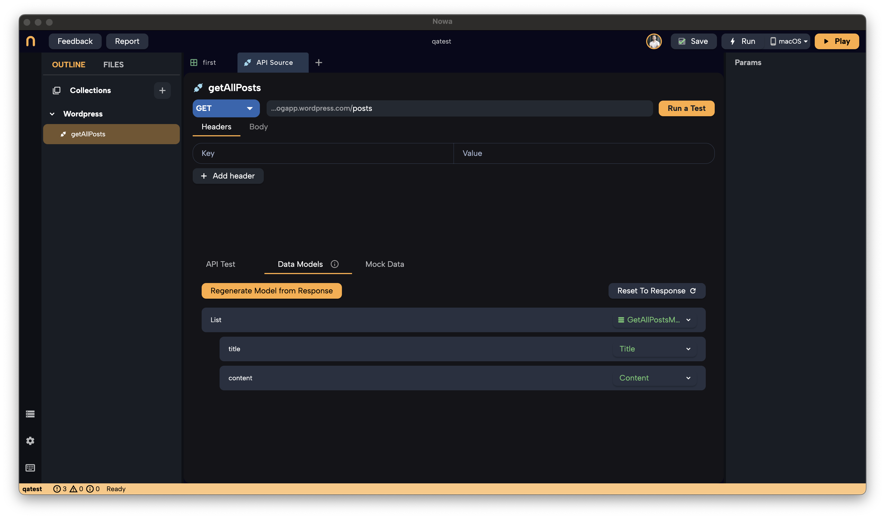

# Generating Models from a Request

In the previous page, we created our first API request, `getAllPosts`, intended to retrieve all posts from a WordPress API. After running the test and ensuring everything works correctly, it's time to generate a model from the response. This model will allow us to use the API data within our app seamlessly.

## Generating a Model from the API Response

To utilize the data returned by the API, we need to convert the raw JSON response into a structured model. Here's how you can generate a model in Nowa:

### Steps:

1. **Run the API Test:**
   - Ensure you have run a test for your API request. This populates the response data needed for model generation. 
   
   *(You can also generate the model using a Mock JSON, but running a test will automatically fill up the data panel to use for model generation)*

2. **Access Data Models:**
   - After running the test, click on **`Data Models`** in the API request interface.

3. **Generate Model from Schema:**
   - Click on **`Generate Model from Schema`**.
   - You will see the JSON data that Nowa will use to generate the model. If you have run a test, this area will be pre-filled with the response data.
   - **Note:** If you cannot run a test (e.g., the API isn't ready), you can paste a mock JSON response here.

   **Tip:** Click on the three dots in the top-right corner to beautify, copy, wrap, or compress the JSON.

4. **Select Data Fields:**
   - Click **`Next`** to proceed.
   - Nowa will display the data structure it plans to model.
   - By default, all data fields are selected. However, it's recommended to select only the fields you need to keep the model simple and efficient.
   - **Example:**
     - For the WordPress API, we might select only `title` and `content`.
     - Within `title` and `content`, select the `rendered` field, which contains the actual text.

5. **Review the Model:**
   - Click **`Next`** to see the models that will be created.
   - You will see:
     - **Top-Level Model:** (e.g., `GetAllPostsModel`) representing each blog post.
     - **Nested Models:** (e.g., `Title`, `Content`) for nested data structures.
   - You can rename the top-level model and adjust the storage path if needed. By default:
     - The model name is `RequestName` + `Model`.
     - The path is the `/models` folder.

6. **Generate the Model:**
   - If everything looks good, click **`Generate`** to create the models.

Here's the full example of generating the model for `getAllPosts` request:

## Understanding the Generated Models

- **List of `GetAllPostsModel`:**
  - Represents a list of blog posts.
  - Each item includes the `Title` and `Content` models.

- **`Title` and `Content` Models:**
  - Contain the `rendered` property, which holds the text for each post's title and content.

## What's Next?

Now that the model is generated, you have a structured representation of your API data. From here, you can:

- **Connect the Request to the UI:**
  - Use the data in your app's screens by wrapping UI elements with a data builder.
  - This allows you to display dynamic content retrieved from the API.

- **Modify Mock Data (Optional):**
  - Access the **`Mock Data`** section to view or edit the mock data.
  - Mock data is used during design time to prevent unnecessary API calls.
  - It's helpful for testing how your UI will look with actual data.

---

**What's coming Next:**

- **[Using the Request in the UI]**
  - Learn how to integrate the API request and models into your app's interface.

- **Working with Mock Data**
  - Understand how to utilize mock data effectively during development.

- **Adding Parameters and Advanced Requests**
  - Explore how to add parameters to your requests and handle `POST` requests using the Circuit (logic editor).

**Proceed to the next section to learn how to use the request in the UI and continue building your app's functionality.**
