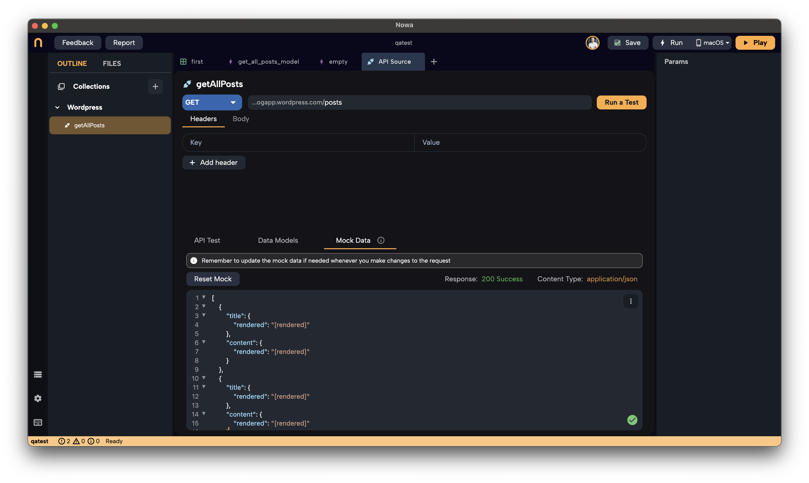
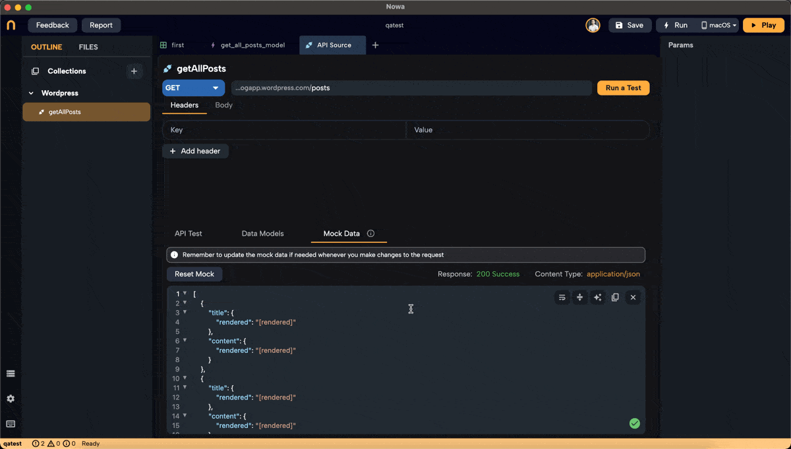
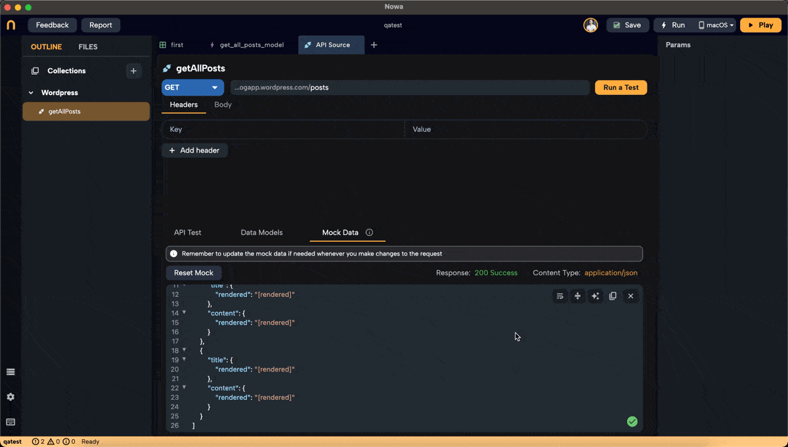

# Dealing with Mock Data in Nowa

In the previous sections, we created a request to fetch all posts from a WordPress blog, generated a model from the response, and connected it to the UI. You might have noticed that the titles displayed as `[rendered]` in the UI designer. 

This is because of the mock data generated when we created the model. In this section, we'll delve deeper into mock data—what it is, how it works, and how you can use it to enhance your development process.

## Understanding Mock Data

**Mock data** is simulated data that mimics the structure of real API responses. It's automatically generated by Nowa when you create a model from your API response. The purpose of mock data is to:

- **Visualize the UI during design time** without making actual API calls.
- **Test and refine the UI layout** with sample data.
- **Simulate different data scenarios** by modifying the mock data.

### How Mock Data is Generated

When we generated the model for our `getAllPosts` request, Nowa created:

- A list containing three instances of `GetAllPostsModel`.
- Each `GetAllPostsModel` instance includes `Title` and `Content` models.
- Each `Title` and `Content` model contains a `rendered` key with a string value of `[rendered]`.

This structure mirrors the actual API response, allowing the UI to display data as if it were coming from the live API.

## Working with Mock Data

### Viewing and Editing Mock Data

You can view and edit the mock data to see how changes affect your UI:

1. **Access the Mock Data:**

   - Go to the **Mock Data** section from the API request.

2. **Modify the Mock Data:**

   - Add or remove items in the list to simulate different data sizes.
   - Change the values of fields like `rendered` to see how different content appears in the UI.
   - For example, you can change `[rendered]` to `"This is a test title"`.

   *Chaning from `[rendered]` to `"This is a test title"` for the first item in Mock.*
   

3. **Observe the Changes in the UI Designer:**

   - As you modify the mock data, the UI designer updates in real-time.
   - If you increase the number of items in the mock data list from three to four, the ListView in the UI will display four items instead of three.

   *Adding an extra item to the mock*
   

### Resetting Mock Data

If you want to revert your mock data to its original state:

- Click on **`Reset Mock`**.
- This action regenerates the mock data based on the current model structure.

### Important Notes

- **Schema Consistency:** Ensure that your mock data matches the structure of your model exactly. If the mock data schema differs from the model, errors will occur in the UI.
  - **Solution:** If you've changed your model's schema, regenerate the model and update the mock data accordingly.
- **Design-Time Use Only:** Mock data is intended for use in the UI designer to preview how your app will look. It does not affect the actual data fetched when the app runs.

## Using Mock Data When API Test Data Isn't Available

Sometimes, you might not have actual test data from the API—perhaps the API isn't ready, or network issues prevent you from fetching data. In such cases:

1. **Generate Models Using Mock Data:**

   - Instead of running a test, you can paste a mock JSON response when generating your model.
   - Follow the same steps as before to generate the model from this mock data.

2. **Use the Mock Data in the UI:**

   - The mock data you provide will be used to generate the model and populate the `data` variable in the UI designer.
   - This allows you to continue designing and testing your UI without needing live API responses.

## Benefits of Using Mock Data

- **Efficiency:** Continue developing your app without delays caused by unavailable APIs.
- **Flexibility:** Test how your UI handles different data scenarios by customizing the mock data.
- **Safety:** Avoid unnecessary API calls during development, which can save on data usage and prevent hitting API rate limits.

## Summary

Mock data is a powerful feature in Nowa that enhances your development workflow by:

- Allowing you to design and test your UI without relying on live API data.
- Providing a way to simulate various data conditions and see how your app responds.
- Ensuring that your UI accurately reflects the structure of your data models.

By understanding and effectively using mock data, you can build robust and responsive UIs that are well-prepared for real-world data once your app is deployed.

Happy building!