# Getting started

Hey! Welcome to Nowa, Nice to have you here. Let's have quick tour together to discover Nowa!

In this tour you will:
> 
1. Create a new project in Nowa /n \n
2. Dicover Nowa's main tools
3. Create your first simple app 
dedew

### Creating a new project

After opening Nowa, you can create a new account using your email, or sign in using your Google account.

After singing in, click on `Create` on the top right to create a new project. The following window will appear asking you for your project name:

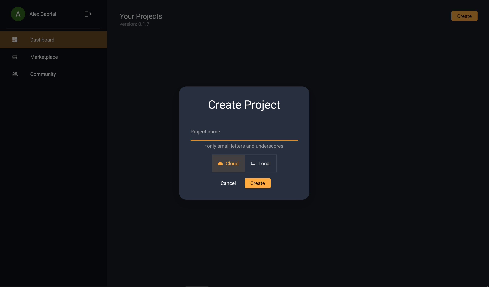

>Note: Your project name should only contain small letters and underscores

>Currently you can only create cloud projects, local projects are coming soon with Nowa's Desktop version 

After creating a new empty project, you will see the following screen:

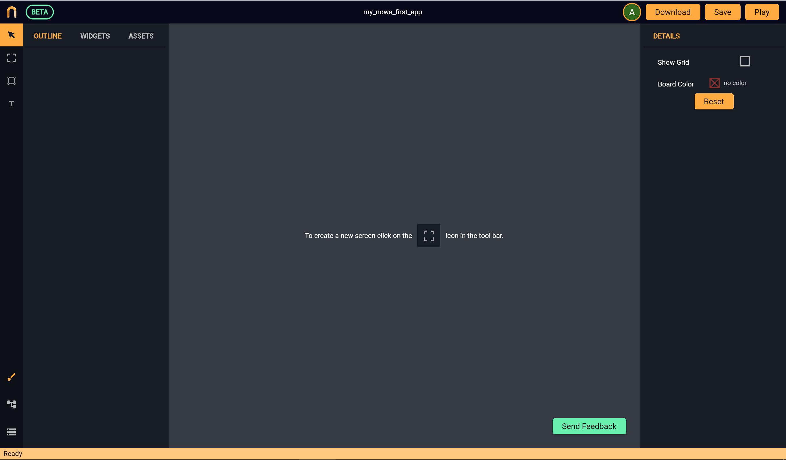

This is the `UI desinger` tool that opens first by default.

---

### Fast overview on the tools

On the end of the left side, you can see the drawing tools. You can create a `Screen`, a `Shape` or a `Text` by clicking one of them and then click on the location on the baord where you want to place them.

On the left side you can also see a panel where you can switch between `Outline`, `Widgets` and `Assets`. 

* `Outline`: Here you can see all the screens you have on baord, with the widget layout for each one. You can also change widgets layouting by drap and drop.
* `Widgets`: Here you can see a list of the avalible widgets to use. By drag and drop, you can use any of the widgets inside your screen.
* `Assets`: You can see all your project files here, including your dart files, your design board, your images, fonts, etc.

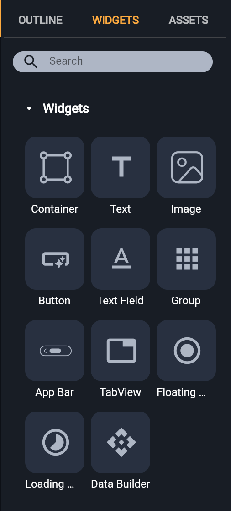

On the left bottom side, you can change the window from the `UI Desinger` to Nowa `VPL` and `Data`. `UI Desinger` window is made to create and design all your app screens. On the other hand, the Visual Programming window (`VPL`) is made to build the logic for the app. `Data` window is used to create API data requests. The bottom yellow bar to show your app status and if any error occurs.

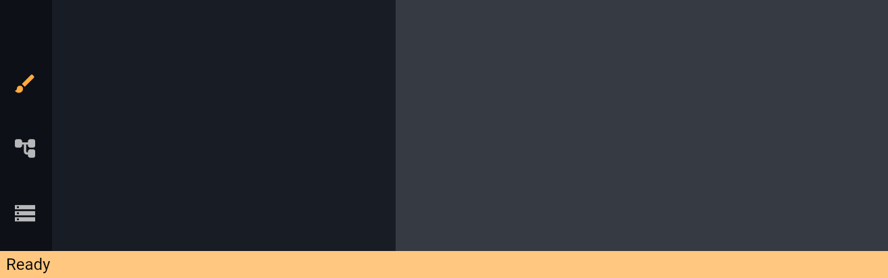

On the top right, you can press on `Download` to download your Flutter project, `Save` to save your changes and `Play` to see how your app will look like on multiple devices.

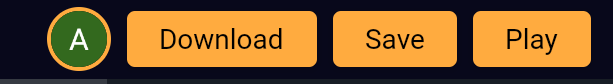

On the right side you can see the *details panel*. Using this panel, you can control the item you select, wether its a widget, a screen, a file or a component. 

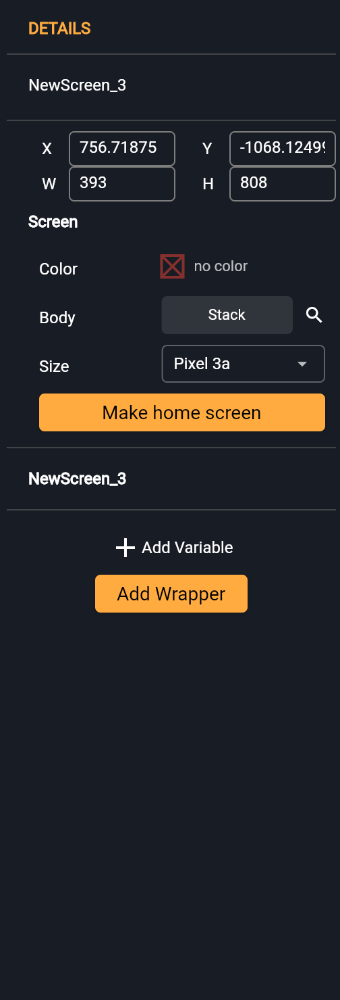

---

### Create your first app

Lets a create a simple app with one screen and a text saying *(as you guessed it)* "Hello world". 

First create a new screen by selecting the `Screen` tool 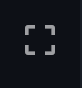 from the drawing tools on the left side, then click on any empty place on the board to place the screen there.

To know more about screens, watch this video tutorial about [creating screens in Nowa ](https://www.youtube.com/watch?v=IwLJBUTm_jA).

Then, create a text by selecting the `Text` tool 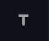
 from the drawing tools and click inside the screen to place it there, notice the outline where it shows you the layout of your screen.

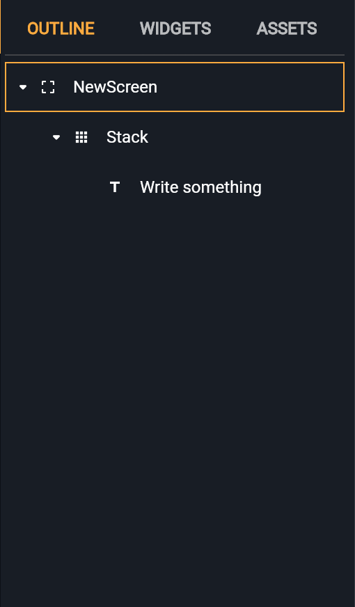

To change the text, select the text widget, then on the right side, change the text using the field `text` in the details panel and make it "Hello world".

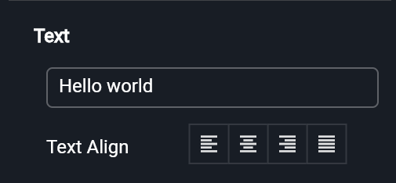

To play the app, you should tell Nowa first which is the first screen in your app. Select the screen and click on "Make home screen". 

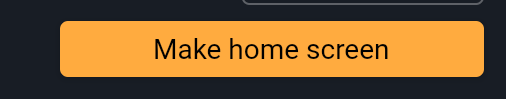

Now, press on `Play` on the top right and watch how your app will look like on any device! you can zoom in or out using the slider on the top right.

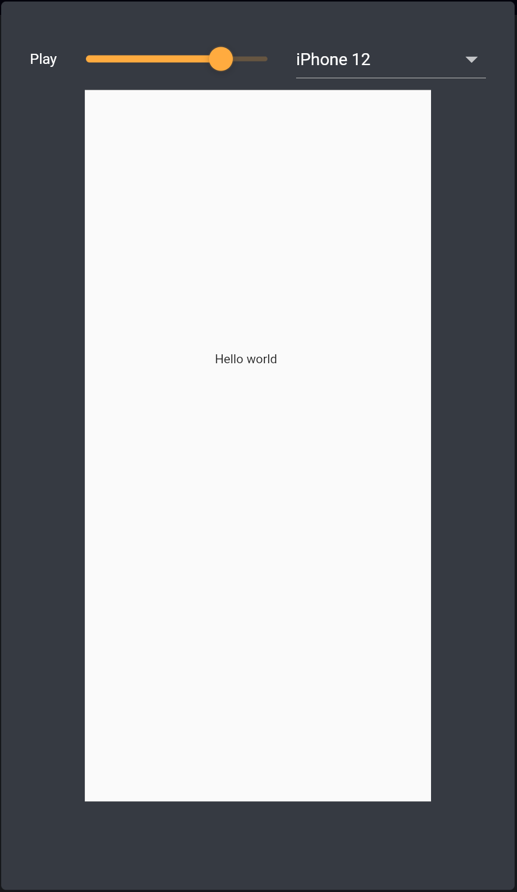

Click on `Download` to download the app as Flutter project and export it.

**Congrats on creating your very first app with Nowa!**

