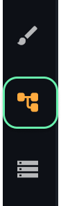
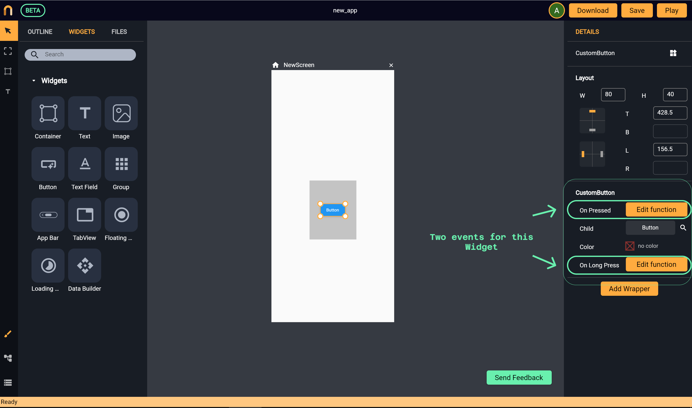

# Nowa Visual Programming
*In this section, you will learn:*
```
1. How to add functionalities to your app using Nowa Visual Programming
2. How to work with event blocks
3. How to print on the LOG by clicking on an Image inside your app
```

Nowa visual programming (NVP) is a way to implement functionality for your app visually without writing code. To open the NVP board, click on NVP icon on the bottom left of the screen as shown below. 



Let’s see how it works and try a small example of printing a message on the LOG when clicking on a button.

### How it works? 

For every screen created, there’s a board that holds all of the screen functionalities. Each screen board will have a group of graphs where each graph presents a specific execution flow (think of it as a group of functions). Each graph starts with an event block, which is the trigger for that graph to be executed, meaning when that event happens, that event block triggers the graph connected to it. 

Those event blocks come for example from widgets that you use on that screen. For example, the `Button` widget has two events `On Pressed` *(this event will be triggered when the user clicks on that button)* and `On Long Press` *(which will be triggered when the user makes a long press on that button )*. Click on `+` button beside each event to add the event block to the board *(If you already added the event block, the `+` button will become `Edit Function`)*. See the following example of the events avalible for a `Button` widget:



When you click on the yellow box (`+` or `Edit Function`) beside any event from the `details panel`, you will be automatically directed to the event block for that widget inside NVP in order to build a graph for it. The following board is for the screen above with the `Button` widget. 


>You have to **add the event blocks by clicking on `+` beside the event name in the details panel in order for them to appear inside the board.** This is done to keep your board clean from events that you don't need.  

### Printing on LOG 

Let’s build a simple app where a message will be printed on the LOG when the user clicks on an image, let’s start:


1. Create a screen, then drop an `Image` widget, and connect it to the image source (either by pasting the URL of an online image or by selecting an already uploaded image from the `Assets`). [See more about images here](import_assets.md).
2. Wrap the image with `GestureDetector` to add clicking functionality for that image. You will see many possible "clicking" events that been added to the image using `GestureDetector` wrapper. We will go with the first event which is `On Tap`, therefore click on the `+` button beside `On Tap` event to add the event block to the board and to automatically navigate to the NVP board for that screen.
3. Drag a line from the event block `On Tap` to connect another block with it *(to be executed when that image is clicked)*, then choose `print` block. Then write down your message inside the block. That’s it! Now click on `Play` and click on the image, you will see your message printed on the LOG. 


