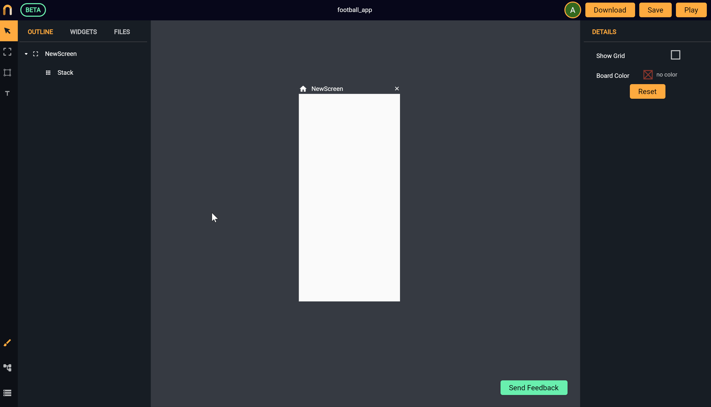
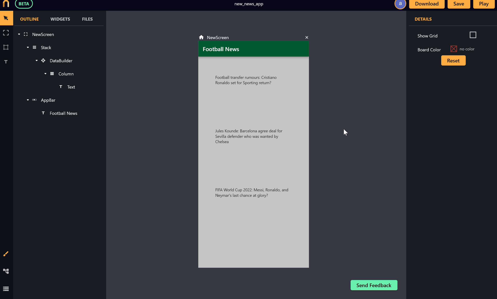
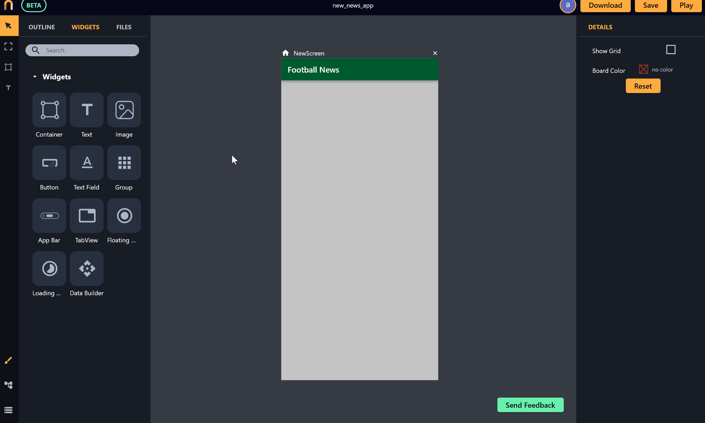

# HTTP GET requests with Nowa

Most of apps use HTTP get requests to fetch data online. In Nowa, Implementing a HTTP GET requests is super simple and easy! Just couple of clicks and you will have your app showing data using an API request with a loading indicator, so lets see how to do that

You need 3 steps to accomplish the task: 
1. Adding a HTTP request to the project.
2. Connecting the UI with the data and control how the data will be displaced.
3. Creating a loading indicator to be shown while your data is being loaded. 
 
So lets see how to do each step:

### Adding a HTTP get request to the project

Here you add all the HTTP requests you will need for your app. To add a HTTP GET request:
1. First go to the `Data` Panel (on bottom left of the screen), and click on `Add` then choose `API request`. Then give your GET request a name *(you will need the name in the UI designer when connecting the UI with the request, and it will be used for naming generated objects for your data as you will see in the coming steps)*. 
2. Choose the request you created, then enter the URL (*the respond should be in JSON format*), and click `Go` to fire a request for the purpose of automatically generating the Schema of the data. *See the following example:*

 

In this example, the respond for the request is as follows: (3 items {news}) with each having: `id`, `createdTime`, and `fields` object that has `Attachments`, `Date`, `Title` and `Article`).

```json

{"records":[{"id":"rec6w3P24XBJYVAta","createdTime":"2022-06-10T11:38:14.000Z","fields":{"Attachments":"https://i.guim.co.uk/img/media/0f9c8a86dde25ba475bd8c74e565b93a8c1af893/0_21_1826_1096/master/1826.jpg?width=620&quality=45&fit=max&dpr=2&s=f81accf4f601d34e10d216225ae1f138","Date":"2022-06-11","Title":"Football transfer rumours: Cristiano Ronaldo set for Sporting return?","Article":"Cristiano Ronaldo seems really keen to leave Manchester United but his options are dwindling by the day. He could even return to first club Sporting CP in order to end his Old Trafford nightmare."}},{"id":"rec9KhgdpFOxqw9G5","createdTime":"2022-06-02T12:39:52.000Z","fields":{"Attachments":"https://e0.365dm.com/22/07/2048x1152/skysports-jules-kounde-sevilla_5842881.jpg?20220722192103","Date":"2022-06-04","Title":"Jules Kounde: Barcelona agree deal for Sevilla defender who was wanted by Chelsea","Article":"Mind what no by kept. Celebrated no he decisively thoroughly. Our asked sex point her she seems. New plenty she horses parish design you. Stuff sight equal of my woody. Him children bringing goodness suitable she entirely put far daughter.\n\nAn so vulgar to on points wanted. Not rapturous resolving continued household northward gay. He it otherwise supported instantly. Unfeeling agreeable suffering it on smallness newspaper be. So come must time no as. Do on unpleasing possession as of unreserved. Yet joy exquisite put sometimes enjoyment perpetual now. Behind lovers eat having length horses vanity say had its.\n\nSky Sports News reported last week that Chelsea were confident of signing the French international defender, but the 23-year-old has chosen to"}},{"id":"recCT3pIJJWY0mDAv","createdTime":"2022-06-02T12:39:52.000Z","fields":{"Attachments":"https://static.euronews.com/articles/stories/06/87/14/16/808x539_cmsv2_94a6f9f0-72bc-5640-94a2-420b66c69867-6871416.jpg","Date":"2022-06-04","Title":"FIFA World Cup 2022: Messi, Ronaldo, and Neymar's last chance at glory?","Article":"Two exquisite objection delighted deficient yet its contained. Cordial because are account evident its subject but eat. Can properly followed learning prepared you doubtful yet him. Over many our good lady feet ask that. Expenses own moderate day fat trifling stronger sir domestic feelings. Itself at be answer always exeter up do. Though or my plenty uneasy do. Friendship so considered remarkably be to sentiments. Offered mention greater fifteen one promise because nor. Why denoting speaking fat indulged saw dwelling raillery.\n\nAdd you viewing ten equally believe put. Separate families my on drawings do oh offended strictly elegance. Perceive jointure be mistress by jennings properly. An admiration at he discovered difficulty continuing. We in building removing possible suitable friendly on. Nay middleton him admitting consulted and behaviour son household. Recurred advanced he oh together entrance speedily suitable. Ready tried gay state fat could boy its among shall.\n\nThe FIFA World Cup will play host to two of the greatest players ever to set foot on a football field: Lionel Messi and Cristiano Ronaldo."}}]}

```

Nowa will generate new objects to organise your Schema. In the following example, an object called `getNewsObj` ( which is <Your request name>Obj) is created to hold the entire data for the request. Another object is created to hold each news item inside the list `records` with the name `getNewsObj_records' (<Your top level object name>_<your list name>). You will need to know the structure for the next step when connecting the data with the UI. *See the following image that shows how Nowa generated the Schema for this example:*
  


### Connecting the UI with the data:
  


 
 


