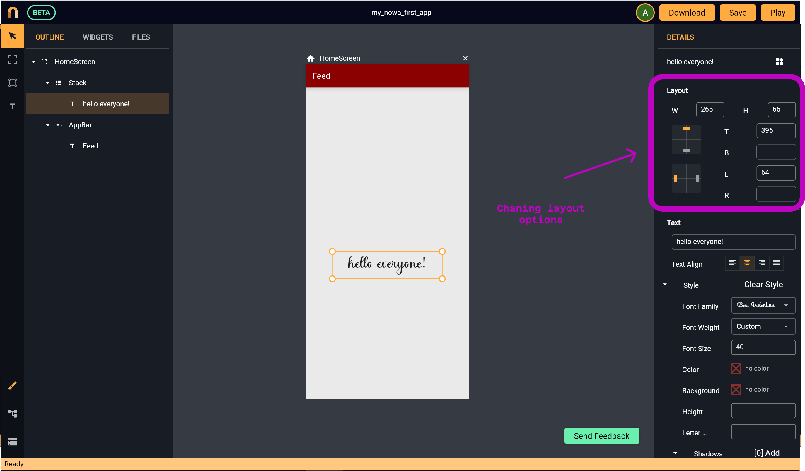
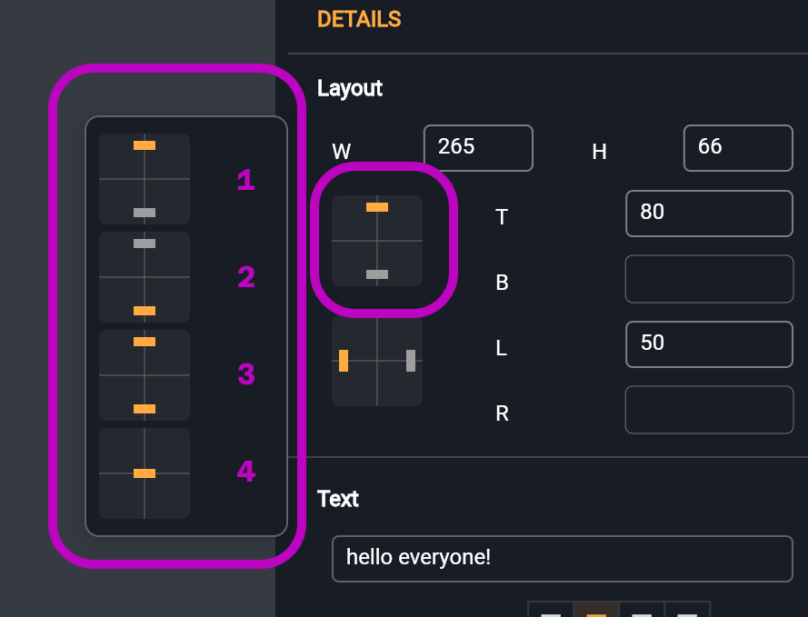
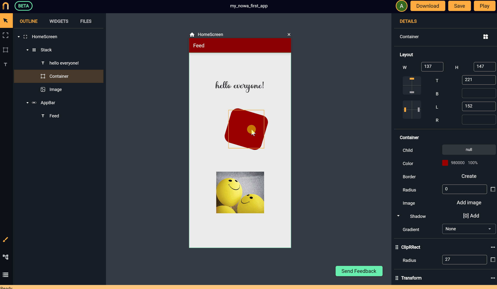

# Layout
*In this section, you will learn:*
```
1. How to add layout rules so the screen will look as expected on different screen sizes
2. How to give dimensions for the widget 
3. How to determine the distance between the widget and each side of the screen
4. How to make the distance between the widget and the screen fixed 
5. How to center a widget or stretch it regardless of the screen size 
6. How to use Nowa snapping feature

```
Placing  widgets randomly on the screen without a structure isn’t a good idea, especially when the app is supposed to run on different devices with different screen sizes, therefore it is always recommended to create some layouts rules so your app will look as you expect regardless of the screen size. 

With Nowa it’s pretty simple. All the layout options are available on the top right of the `details panel` after you select the widget that you want to set the layout rules for. See the following screenshot:



* To give a fixed size for a widget, you can simply write the width and height of the widget inside the fields `W`, `H` (in logical pixels).
* Using the fields (`T`, `B`, `L`, `R`) you can determine a fixed distance for the widget from the top, bottom, left or right. 

> Since there are multiple ways to determine the layout, **be careful to not include rules that conflict with each other.** 

> Layouting options work when the body widget of the screen is `Stack` (which is the default option). If the main body widget is `Coloum` for example, then there’s another way to determine the layout of the widget using the column parameters which can be accessed using the `details panel`. For more details, take a look into [Groups](groups.md).

### Fixing distance from a side, centering or stretching

Let’s say you want the widget to have a fixed distance from one side of the screen. In this case, you can use the icon on the left side of `L`, `B` to control the vertical axis, and the icon on the left of `T`, `R` to control the horizontal axis. Let’s explore the options for the vertical axis for example: 

After clicking on the icon, four options will appear. Let's see what each option means:



1. Fix the distance of the widget with the top of the screen: *meaning that whatever screen size will be, the distance between the widget and the top of the screen will be fixed and equal the current logical pixels between the widget and the top the screen.**
2. Fix the distance between the widget and the bottom of the screen.
3. Stretch: *will make the widget stretch in the vertical axis by making height of the widget equal the height of the screen regardless of the screen size.*
4. Center: *will place the widget exactly in the center vertically so the distance between the widget and the top of the screen will be equal to the distance with the bottom of the screen regardless of the screen size.*

### Snapping

You can easily align widgets corresponding to each other with Nowa. By simply drag the widget and move it slowly, the snapping feature will help you position the widget corresponding to other widgets in the screen by showing you green lines to align widgets together. When you see an alignment line you want to use, just drop the widget there and they will be aligned. See the following example:


 


