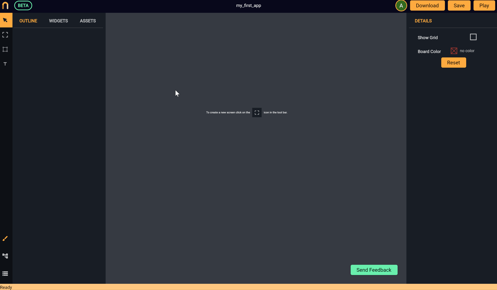
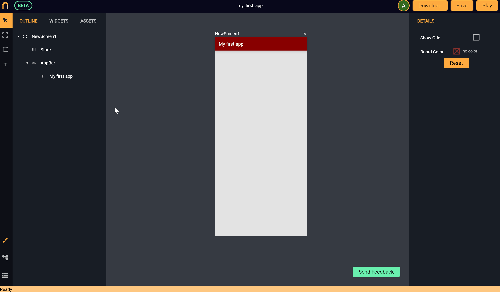

# Intro to UI design 


>Nicer for the eye, closer to the heart! 

*Creating an app with a nice design holds a alot of value for your app! therfore You creating an awsome designs easily is our top prioirty!*

We aim to make creating UI with Nowa feels like freehand drawing!  

*In this section, you will learn about:*
```
1. Creating screens with different sizes
2. Create UI Boards
3. Use Widgets and drawing tools
4. Use the outline panel for updating the widget trees
5. Use Assets panel to access files, see code, and create items 
```
--- 
When creating a new project or opening an exisiting one, the UI design window will be opened by default. 

You already got some overview about the tools from the [Getting Started](../getting_started.md) page, but in this one we will dive together into little more details.


## Creating a screen
To create a new screen, click on the `Screen` tool from the drawing panel on the left side, then click on an an empty place on the baord to create a screen. The size of the created screen will be by default the size of `Pixel 3a`.

What if you want another screen size? it's simple. When selecting the screen tool and before you clicking on an empty place on the board, you will see multiple screen size options inside the `details panel` on the right size. Select the size you want, then click on an empty place to create the screen. See the image below:

 

What if you feel creative and you want a custom size? Of course you can do it! After selecting the `Screen` tool, click on an empty place on tha board, then keep holding and drag to create a screen in the size you want. See the image below:




## Boards 
You can create all your app screens in the same default baord, which will make you able to move fast between them. But it can get messty when you have an app with alot of screens. In this case organising your designs a little bit will be a nice option! with Nowa, you can create new boards where each one hold some of your screens.

To see the boards you already have, click on `Assets` Panel, then open `lib` folder. There you will find all your boards. Click on any board to open it.

To create a new one, click on `Add`, then on `New board`, write down the new name then cick on `Create`. See the image below:



## Widgets and shapes
Widgets and shapes are your magical building boxes to create your nice UI. By drag-and-drop, you can build the UI you want. After dropping the widget or drawing the shape, use the details panel on the right to customise its parameters.  


Nowa gives you a flexible ways to build your UI. For exmaple, to build an `AppBar`, you can drag and drop the `AppBar` widget directly and customize it using the `details panel`. See the following image: 

 

But if you want to have more control of the appearance of the `AppBar`, you can build one from scratch using the drawing tools. For example, use the shape tool to draw a shape that look like an AppBar, customize its boarders, colors and other properties, and drop a text inside or a button, exactly like you are sketching the UI using a mockup tool.

 


## Using the `Outline` Panel 


## Using the `Assets` Panel 


