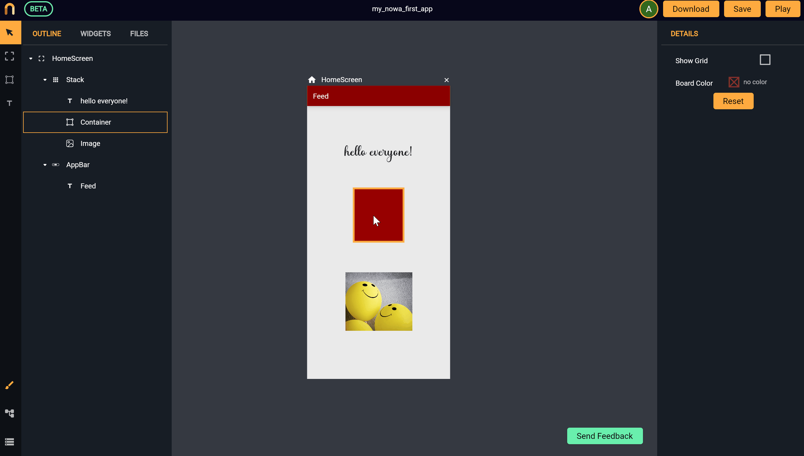

# Wrappers
*In this section you will learn:*
```
1. What are wrappers and how to add them to your widgets
2. Why using wrappers
3. How to add (padding, rotation, scrolling, opactiy, etc.) to your widgets
4. How to make any widget interact with user clicks
```
### What are wrappers
`Wrappers` are a group of items that wrap existing widgets in order to give them more functionality or affect the way they appear. 

From Futter perceptive, they are technically widgets that usually be on top of other widgets to add more characteristics in terms of UI or functionality.

### Why using wrappers

For example, with wrappers, you can make a `Container` clickable by wrapping it with `GestureDetector`, add an opacity option to a text, rotate a widget by wrapping it with `Transform`, make a long column scrollable by wrapping a column with `Scroll view`, Or add `Padding` to widgets.

You can have multiple wrappers on each widget. Removing a wrapper by clicking on the three dots sign on the right of the wrapper name in the `details panel` then clicking on `Remove`.

See the following example of adding `Padding` and `Transformer` wrappers to a `Container`:

 

> The list of available wrappers will keep expanding. Stay tuned for more!

>We will be happy to listen to your suggestions for a feature of an improvement. Please contact us at `info@nowa.dev` or use our [discord server](https://discord.com/invite/ByKfn3H7gX) or [Instagram page](https://instagram.com/nowa.dev).
